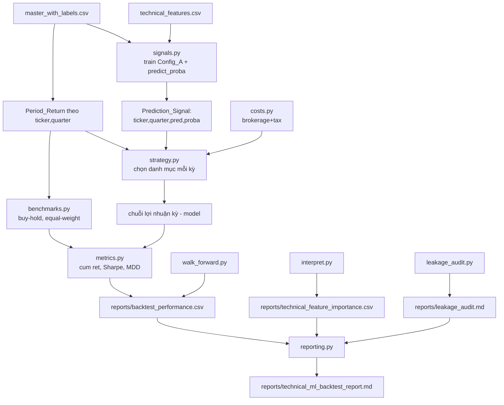

# Design Document

## Overview

Tính năng `technical-ml-investment-backtest` bổ sung một tầng **đánh giá đầu tư** lên trên
pipeline dự báo xu hướng giá HOSE-80 hiện có, biến kết quả *độ chính xác dự báo* (balanced
accuracy ≈ 0,76) thành kết quả *giá trị đầu tư thực tế* (lợi nhuận, Sharpe, drawdown), đồng
thời củng cố độ tin cậy bằng walk-forward, diễn giải mô hình, và kiểm toán rò rỉ dữ liệu.

Tính năng được xây dựng như một gói Python độc lập `backtest/`, **tách biệt** với `pipeline/`
(TASK sản xuất) và `experiments/` (thí nghiệm văn bản). Nó **tái sử dụng** các hàm huấn luyện
của `pipeline/task10_train.py` như một thư viện, **không sửa hành vi mặc định** của pipeline.

Năm nguyên tắc thiết kế:

1. **Tái dùng pipeline, không sửa production.** Mọi huấn luyện đi qua các helper hiện có
   (`load_and_merge_data`, `identify_feature_columns`, `time_series_split`, `fit_imputer`,
   `prepare_features`, `build_ml_models`) để so sánh nhất quán với baseline luận văn.
2. **Không rò rỉ thời gian.** Tín hiệu cho `Period_q` chỉ dùng thông tin ≤ q; imputer fit
   trên train, transform test; walk-forward chỉ huấn luyện trên dữ liệu trước cutoff.
3. **Tách bạch tín hiệu và mô phỏng.** Tầng tạo tín hiệu (ML) độc lập với tầng mô phỏng đầu
   tư (thuần tài chính) — dễ kiểm thử và dễ thay chiến lược.
4. **Phí giao dịch sát thực tế VN.** Brokerage_Fee (0,15%, cả mua/bán) + Sell_Tax (0,1%,
   chỉ bán), chỉ áp trên phần vốn thực sự thay đổi vị thế.
5. **Mọi thứ ra artifact + báo cáo.** Mỗi thành phần ghi CSV/MD để đưa thẳng vào luận văn.

### Giả định thị trường chứng khoán cơ sở Việt Nam (bắt buộc)

Thị trường cơ sở VN có các đặc thù ràng buộc trực tiếp cách mô phỏng đầu tư. Toàn bộ
Strategy_Simulator và benchmark tuân thủ:

- **Long-only (một chiều).** Chỉ kiếm lời khi giá tăng: chỉ mua các mã dự báo "tăng"; **không
  bán khống** mã dự báo "giảm" (thị trường cơ sở VN cấm short; short chỉ có ở phái sinh —
  ngoài phạm vi). Đây là ràng buộc thiết kế cứng, không có biến thể long-short.
- **Thanh toán T+2.** Cổ phiếu mua về tài khoản sau 2 ngày làm việc mới bán được → không lướt
  sóng trong kỳ. Với backtest theo quý, kỳ nắm giữ dài hơn nhiều nên T+2 chỉ là giả định nền.
- **Biên độ giá HOSE ±7%/phiên.** Danh mục toàn mã HOSE. Vì backtest dùng suất sinh lời kỳ
  (không mô phỏng khớp lệnh từng phiên), biên độ được xử lý như giả định thanh khoản: giả định
  mọi lệnh khớp ở mức suất sinh lời kỳ đã ghi nhận.
- **Lô tối thiểu 100 cổ phiếu + giả định vốn đủ lớn.** Phân bổ vốn theo tỷ trọng, giả định NAV
  đủ lớn để bỏ qua hiệu ứng lô lẻ (rounding).
- **Bỏ qua trượt giá (slippage).** Chỉ tính chi phí tường minh (brokerage + sell_tax).

Các giả định này được ghi vào `reports/technical_ml_backtest_report.md` (Req 2.8, 9.4) để hội
đồng thấy rõ phạm vi hiệu lực của kết quả.

## Architecture

### Vị trí module — thư mục `backtest/`

```
backtest/
├── __init__.py
├── signals.py           # Prediction_Signal: lấy nhãn + XÁC SUẤT từ Technical_Model (Req 1)
├── strategy.py          # Strategy_Simulator: dự đoán → danh mục → lợi nhuận kỳ (Req 2)
├── costs.py             # Transaction_Cost: Brokerage_Fee + Sell_Tax (Req 3)
├── benchmarks.py        # Benchmark_Strategy: buy-and-hold, equal-weight (Req 4)
├── metrics.py           # Performance_Evaluator: cum return, Sharpe, MDD, hit rate (Req 5)
├── walk_forward.py      # Walk_Forward_Evaluator: nhiều cutoff (Req 6)
├── interpret.py         # Model_Interpreter: SHAP + permutation cho Config_A (Req 7)
├── leakage_audit.py     # Leakage_Auditor: kiểm tra rò rỉ thời gian (Req 8)
├── reporting.py         # Backtest_Reporter: báo cáo tổng hợp (Req 9)
└── run_backtest.py      # CLI orchestrator (Req 10.5)
```

### Luồng dữ liệu



### Tái sử dụng `task10_train.py` — bổ sung xác suất

`run_configs_return_predictions()` hiện trả về `test_index (ticker, quarter_id)`, `y_test`,
`pred_by_config` (chỉ **nhãn**), `model_name`. Backtest cần thêm **xác suất** lớp "tăng" cho
biến thể top-N (Req 2.5) và cho xếp hạng. Thiết kế bổ sung một hàm mới trong `backtest/signals.py`
**không sửa** `task10_train.py`, mà tái dùng các helper cấp thấp của nó:

```python
# backtest/signals.py
from pipeline.task10_train import (
    load_and_merge_data, identify_feature_columns, get_feature_configs,
    time_series_split, fit_imputer, prepare_features, build_ml_models,
)

def generate_signals(
    tech_path=TECH_FEATURES_PATH,
    labels_path=LABELS_PATH,
    cutoff="2025Q1",
    model_name="LightGBM",           # Req 1.4
    config="Config_A",                # chỉ đặc trưng kỹ thuật
) -> "SignalFrame":
    """Huấn luyện Technical_Model trên Config_A qua cùng split/imputer của
    pipeline, trả về nhãn + xác suất lớp 'tăng' cho từng (ticker, quarter_id)
    của tập test, đã gắn Period_Return (Req 1.2, 1.3)."""
```

`SignalFrame` là một `pd.DataFrame` cột: `ticker, quarter_id, y_true, pred_label,
pred_proba_up, period_return`. `period_return` lấy từ cột `return` của
`master_with_labels.csv` (đã xác nhận tồn tại), căn theo `(ticker, quarter_id)`; hàng thiếu
`return` bị loại và đếm lại (Req 1.5).

Lý do dùng cột `return` làm Period_Return: đây là suất sinh lời tới kỳ kế tiếp — khớp đúng
định nghĩa nhãn "giá trung bình kỳ kế tiếp tăng/giảm", nên quyết định "mua ở kỳ q dựa trên
dự đoán tăng" nhận đúng `return[q]` làm lợi nhuận kỳ nắm giữ. Không rò rỉ vì dự đoán chỉ dùng
đặc trưng ≤ q, còn `return[q]` là kết quả *sau khi* ra quyết định.

## Components and Interfaces

### 1. Prediction_Signal (`backtest/signals.py`) — Req 1

Đã mô tả `generate_signals` ở trên. Chi tiết:

- Huấn luyện đúng `model_name` trên `Config_A` (technical only); mặc định chọn mô hình có BA
  cao nhất — thực thi bằng cách chạy nhanh 4 mô hình một lần và chọn max BA, hoặc nhận
  `model_name` tường minh (mặc định `"LightGBM"` theo kết quả baseline).
- Fit imputer trên train, transform test (Req 8.4, tái dùng `fit_imputer`/`prepare_features`).
- Trả `pred_proba_up = model.predict_proba(X_test)[:, 1]`.

### 2. Strategy_Simulator (`backtest/strategy.py`) — Req 2

Chiến lược là **thuần long-only** — không có tham số hay nhánh nào tạo vị thế short (Req 2.2).

```python
@dataclass
class StrategyConfig:
    top_n: int | None = None          # None → chọn mọi mã dự đoán "tăng" (Req 2.1)
                                      # >0   → top-N theo pred_proba_up (Req 2.6)
    cost: "CostConfig | None" = None  # None → không phí; có → áp phí (Req 3)

def simulate_strategy(signals: SignalFrame, cfg: StrategyConfig) -> "StrategyResult":
    """Long-only. Với mỗi quarter_id trong tập test (sort tăng dần):
    - chọn danh mục MUA: các ticker pred_label==1 (hoặc top-N theo proba) (Req 2.1, 2.6)
    - KHÔNG mở vị thế short với mã pred_label==0 — chỉ bỏ qua chúng (Req 2.2)
    - phân bổ đều (Req 2.3); nếu rỗng → giữ tiền mặt, return kỳ = 0 (Req 2.4)
    - lợi nhuận kỳ = mean(period_return của mã được chọn) (Req 2.5)
    - áp Transaction_Cost trên phần danh mục thay đổi so với kỳ trước (Req 3)
    Chỉ dùng thông tin ≤ q (Req 2.7)."""
```

`StrategyResult`: `period_returns: pd.Series` (index = quarter_id), `period_returns_gross`,
`period_returns_net`, `turnover_by_period`, `total_cost`, `holdings_by_period: dict`.

**Tính lợi nhuận danh mục theo kỳ (thuần, pure function → dễ test):**

```python
def portfolio_period_return(selected_returns: list[float]) -> float:
    return float(np.mean(selected_returns)) if selected_returns else 0.0
```

### 3. Transaction_Cost (`backtest/costs.py`) — Req 3

```python
@dataclass(frozen=True)
class CostConfig:
    brokerage: float = 0.0015   # 0,15% mỗi lượt mua/bán (Req 3.1)
    sell_tax: float = 0.0010    # 0,1% chỉ khi bán (Req 3.1)

def turnover(prev_weights: dict[str,float], new_weights: dict[str,float]) -> tuple[float,float]:
    """Trả (buy_value, sell_value) — tổng trọng số tăng (mua) và giảm (bán)
    giữa hai kỳ, chuẩn hóa theo NAV=1 (Req 3.4: chỉ phần thay đổi)."""

def period_cost(prev_w, new_w, cfg: CostConfig) -> float:
    buy_v, sell_v = turnover(prev_w, new_w)
    return buy_v * cfg.brokerage + sell_v * (cfg.brokerage + cfg.sell_tax)  # Req 3.2, 3.3
```

Round-trip hiệu dụng ở mặc định: mua 0,15% + bán (0,15%+0,10%) = **0,40%** (Req 3.5).
Kỳ đầu tiên: toàn bộ danh mục là "mua mới" → tính brokerage trên toàn phần vốn vào.

### 4. Benchmark_Strategy (`backtest/benchmarks.py`) — Req 4

```python
def buy_and_hold_equal(signals_or_returns) -> StrategyResult:
    """Phân bổ đều toàn bộ ticker có mặt, giữ suốt kỳ test (Req 4.1)."""

def equal_weight_rebalanced(returns_by_period) -> StrategyResult:
    """Mỗi kỳ tái cân bằng đều trên mọi ticker có dữ liệu kỳ đó (Req 4.2)."""
```

Cả hai đo bằng cùng `Performance_Evaluator` trên cùng khoảng test (Req 4.3).

### 5. Performance_Evaluator (`backtest/metrics.py`) — Req 5

Các pure function (mục tiêu property/unit test):

```python
def cumulative_return(period_returns: pd.Series) -> float:      # ∏(1+r)−1 (Req 5.1)
def mean_std_period(period_returns) -> tuple[float,float]:      # (Req 5.2)
def sharpe_ratio(period_returns, rf: float = 0.0) -> float:     # (Req 5.3)
def max_drawdown(period_returns) -> float:                      # từ equity curve (Req 5.4)
def hit_rate(period_returns) -> float:                          # tỷ lệ kỳ > 0 (Req 5.5)

def evaluate_all(strategies: dict[str, StrategyResult]) -> pd.DataFrame:
    """Bảng chỉ số mọi chiến lược → reports/backtest_performance.csv (Req 5.6)."""
```

`sharpe_ratio` = mean(r−rf)/std(r), std dùng ddof=1; std=0 → trả 0 hoặc NaN có kiểm soát.
`max_drawdown`: dựng equity `E_t = ∏(1+r_i)`, MDD = min_t (E_t/max_{s≤t} E_s − 1).

### 6. Walk_Forward_Evaluator (`backtest/walk_forward.py`) — Req 6

```python
def run_walk_forward(cutoffs: list[str], model_name="LightGBM") -> pd.DataFrame:
    """Với mỗi cutoff: generate_signals(cutoff=...) → BA, AUC (Req 6.2);
    simulate_strategy → cumulative_return (Req 6.3). Chỉ train trên kỳ < cutoff
    (Req 6.5, đảm bảo bởi time_series_split). Ghi walk_forward_results.csv (Req 6.4)."""
```

Tập cutoff mặc định gồm các quý đủ số kỳ test (ví dụ `2024Q3, 2025Q1, 2025Q3`), phù hợp
chuỗi 17 quý hiện có; mỗi cutoff cần ≥ vài kỳ test để chỉ số có ý nghĩa.

### 7. Model_Interpreter (`backtest/interpret.py`) — Req 7

```python
def interpret_technical_model(model, X_test, feature_names) -> pd.DataFrame:
    """SHAP (TreeExplainer cho mô hình cây; LinearExplainer/permutation cho
    LogReg) xếp hạng 16 đặc trưng kỹ thuật theo mean|SHAP| (Req 7.1);
    permutation_importance theo balanced accuracy (Req 7.2).
    Ghi technical_feature_importance.csv (Req 7.3) + biểu đồ PNG (Req 7.4)."""
```

Tái dùng khuôn mẫu SHAP đã có trong `pipeline/task11_*`/`experiment_*` nếu có; nếu mô hình
không hỗ trợ TreeExplainer thì fallback về permutation importance.

### 8. Leakage_Auditor (`backtest/leakage_audit.py`) — Req 8

Kiểm tra tĩnh + thống kê, không huấn luyện lại:

```python
def audit_leakage(tech_path, labels_path, cutoff, corr_threshold=0.95) -> "AuditResult":
    """(a) Xác nhận đặc trưng kỹ thuật của kỳ q chỉ từ giá ≤ q — kiểm tra tên
        cột và định nghĩa (return_prev_q, return_2q_ago là quá khứ; return_q,
        volatility_q là trong-kỳ, hợp lệ) (Req 8.1);
    (b) Xác nhận cột nhãn/return tương lai KHÔNG nằm trong tập feature (Req 8.2);
    (c) Với mỗi đặc trưng, tính |corr| với nhãn; nếu > corr_threshold → cờ đỏ
        rà soát thủ công (Req 8.3);
    Ghi leakage_audit.md (Req 8.5)."""
```

`AuditResult`: `feature_windows: dict[str,str]` (in-period/past), `label_not_in_features: bool`,
`high_corr_flags: list[(feature, corr)]`, `passed: bool`.

Lưu ý: đây là điểm hội đồng dễ vặn vì BA 0,76 khá cao. Auditor cung cấp bằng chứng tường minh
rằng `return_q`/`volatility_q` là đặc trưng *trong kỳ* (dùng để dự báo kỳ *kế tiếp*), không
phải nhãn tương lai.

### 9. Backtest_Reporter (`backtest/reporting.py`) — Req 9

```python
def generate_backtest_report() -> str:
    """Gộp backtest_performance.csv (Req 9.1), walk_forward_results.csv (Req 9.2),
    technical_feature_importance.csv + leakage_audit.md (Req 9.3), viết nhận xét
    mô hình có/không tạo giá trị vượt benchmark kèm giả định & giới hạn (Req 9.4).
    Ghi reports/technical_ml_backtest_report.md (Req 9.5)."""
```

### 10. CLI orchestrator (`backtest/run_backtest.py`) — Req 10.5

```
python -m backtest.run_backtest --all
python -m backtest.run_backtest --signals --model LightGBM
python -m backtest.run_backtest --walk-forward
python -m backtest.run_backtest --interpret --audit --report
```

Thứ tự `--all`: signals → strategy+benchmarks → metrics → walk-forward → interpret → audit →
report.

## Data Models

### `SignalFrame` (in-memory + tùy chọn CSV) — Req 1

| Cột | Kiểu | Mô tả |
|---|---|---|
| `ticker` | str | Mã cổ phiếu |
| `quarter_id` | str | Kỳ (Period_q) trong tập test |
| `y_true` | int | Nhãn thật (0/1) |
| `pred_label` | int | Nhãn dự đoán (0/1) |
| `pred_proba_up` | float | Xác suất dự đoán lớp "tăng" |
| `period_return` | float | Suất sinh lời kỳ (cột `return` của master) |

### `reports/backtest_performance.csv` — Req 5.6

| Cột | Mô tả |
|---|---|
| `strategy` | `model` / `buy_hold_equal` / `equal_weight_rebalanced` |
| `cost_scenario` | `gross` (không phí) / `net` (có phí) |
| `cumulative_return` | Lợi nhuận tích lũy qua kỳ test |
| `mean_period_return` | Lợi nhuận trung bình theo kỳ |
| `std_period_return` | Độ lệch chuẩn theo kỳ |
| `sharpe_ratio` | Sharpe (rf cấu hình được) |
| `max_drawdown` | Sụt giảm tối đa |
| `hit_rate` | Tỷ lệ kỳ dương (chỉ chiến lược model) |
| `total_cost` | Tổng chi phí giao dịch tích lũy (kịch bản net) |

### `reports/walk_forward_results.csv` — Req 6.4

| Cột | Mô tả |
|---|---|
| `cutoff` | Điểm chia thời gian |
| `n_test` | Số mẫu test tại cutoff |
| `balanced_accuracy` | BA của Technical_Model |
| `auc_roc` | AUC |
| `strategy_cumulative_return_net` | Lợi nhuận tích lũy chiến lược model (có phí) |
| `buy_hold_cumulative_return` | Benchmark buy-and-hold để đối chiếu |

### `reports/technical_feature_importance.csv` — Req 7.3

| Cột | Mô tả |
|---|---|
| `feature` | Tên đặc trưng kỹ thuật (16 đặc trưng) |
| `mean_abs_shap` | mean(\|SHAP\|) |
| `permutation_importance` | Mức giảm BA khi hoán vị đặc trưng |
| `rank` | Thứ hạng theo mean_abs_shap |

## Correctness Properties

*A property is a characteristic or behavior that should hold true across all valid executions
of a system — essentially, a formal statement about what the system should do.*

Backtest chứa nhiều pure function tài chính (lợi nhuận danh mục, phí, Sharpe, drawdown, chọn
danh mục) rất hợp với property-based testing. Phần huấn luyện ML và sinh báo cáo kiểm bằng
unit/integration test.

### Property 1: Lợi nhuận danh mục là trung bình lợi nhuận các mã được chọn

*For any* tập lợi nhuận hữu hạn của các mã được chọn trong một kỳ, `portfolio_period_return`
SHALL bằng trung bình cộng của các lợi nhuận đó; và SHALL bằng 0 khi không mã nào được chọn.

**Validates: Requirements 2.3, 2.4**

### Property 2: Chọn danh mục đúng theo dự đoán và top-N (long-only)

*For any* SignalFrame của một kỳ, khi `top_n` là None danh mục được chọn SHALL bằng đúng tập
mã có `pred_label == 1`; khi `top_n = k > 0` danh mục SHALL là tập con ≤ k mã có
`pred_proba_up` cao nhất trong số mã `pred_label == 1`. Trong mọi trường hợp, danh mục SHALL
KHÔNG chứa mã có `pred_label == 0` (không có vị thế short) và mọi trọng số danh mục SHALL không
âm.

**Validates: Requirements 2.1, 2.2, 2.6**

### Property 3: Chi phí giao dịch không âm và bằng 0 khi danh mục không đổi

*For any* hai cấu hình trọng số danh mục, `period_cost` SHALL không âm; SHALL bằng 0 khi hai
danh mục giống hệt nhau (không turnover); và SHALL tăng đơn điệu theo mức thay đổi danh mục.

**Validates: Requirements 3.2, 3.3, 3.4**

### Property 4: Phí bán cao hơn phí mua cùng giá trị

*For any* giá trị giao dịch dương, tổng phí cho một lượt bán (`brokerage + sell_tax`) SHALL
lớn hơn tổng phí cho một lượt mua cùng giá trị (`brokerage`), phản ánh đúng thuế bán 0,1%.

**Validates: Requirements 3.1, 3.3**

### Property 5: Lợi nhuận net không vượt lợi nhuận gross

*For any* chuỗi quyết định danh mục với chi phí không âm, Cumulative_Return ở kịch bản net
(có phí) SHALL nhỏ hơn hoặc bằng Cumulative_Return ở kịch bản gross (không phí).

**Validates: Requirements 3.5, 5.1**

### Property 6: Lợi nhuận tích lũy là tích các gross-return theo kỳ

*For any* chuỗi lợi nhuận kỳ, `cumulative_return` SHALL bằng ∏(1 + r_t) − 1; và với chuỗi chỉ
gồm các số 0, SHALL bằng 0.

**Validates: Requirements 5.1**

### Property 7: Cận của Max_Drawdown

*For any* chuỗi lợi nhuận kỳ, `max_drawdown` SHALL nằm trong khoảng [−1, 0]; SHALL bằng 0 khi
mọi lợi nhuận kỳ không âm; và SHALL không phụ thuộc việc thêm các kỳ có lợi nhuận bằng 0 ở
cuối chuỗi sau đỉnh.

**Validates: Requirements 5.4**

### Property 8: Sharpe bằng 0/không đổi theo biến đổi hợp lệ

*For any* chuỗi lợi nhuận kỳ có độ lệch chuẩn dương, `sharpe_ratio` SHALL bằng
mean(r−rf)/std(r); và khi mọi lợi nhuận kỳ bằng nhau (std = 0), hàm SHALL trả về giá trị
được xác định rõ (0 hoặc NaN) mà không ném lỗi.

**Validates: Requirements 5.3**

### Property 9: Không rò rỉ thời gian trong walk-forward

*For any* cutoff trong tập walk-forward, tập mẫu dùng để huấn luyện Technical_Model SHALL chỉ
gồm các mẫu có `quarter_id < cutoff`; việc thay đổi dữ liệu của các kỳ ≥ cutoff SHALL không
làm thay đổi mô hình đã huấn luyện cho cutoff đó.

**Validates: Requirements 6.1, 6.5, 8.4**

### Property 10: Hit rate là tỷ lệ hợp lệ

*For any* chuỗi lợi nhuận kỳ, `hit_rate` SHALL nằm trong [0, 1] và bằng tỷ lệ số kỳ có lợi
nhuận dương trên tổng số kỳ.

**Validates: Requirements 5.5**

### Property 11: Ràng buộc long-only trên toàn danh mục qua các kỳ

*For any* SignalFrame nhiều kỳ và mọi StrategyConfig, tổng trọng số danh mục mỗi kỳ SHALL nằm
trong [0, 1] (phần còn lại là tiền mặt), mọi trọng số thành phần SHALL không âm, và không kỳ
nào chứa vị thế trọng số âm — bảo đảm mô phỏng tuân thủ ràng buộc một chiều của thị trường cơ
sở VN.

**Validates: Requirements 2.2, 2.3**

## Error Handling

- **Thiếu Period_Return (Req 1.5):** loại (ticker, quarter_id) khỏi mô phỏng, đếm và ghi số
  lượng bị loại vào log + báo cáo; không ném lỗi.
- **Kỳ không có mã "tăng" (Req 2.3):** giữ tiền mặt, lợi nhuận kỳ = 0, không lỗi.
- **std = 0 khi tính Sharpe:** trả giá trị xác định (0 hoặc NaN có kiểm soát), không chia cho 0.
- **Phân khúc/cutoff quá nhỏ (Req 6):** nếu một cutoff cho tập test rỗng hoặc một lớp nhãn,
  ghi cảnh báo và bỏ qua cutoff đó thay vì làm sập toàn bộ walk-forward.
- **Mô hình không hỗ trợ TreeExplainer (Req 7):** fallback về permutation importance, ghi chú
  trong báo cáo.
- **File giá/nhãn thiếu:** ném lỗi rõ ràng nêu tên file thiếu (fail fast cho lỗi cấu hình).

## Testing Strategy

- **Property-based (Hypothesis, ≥100 iterations):** P1–P10 ở trên cho các pure function tài
  chính (`portfolio_period_return`, chọn danh mục, `period_cost`, `cumulative_return`,
  `max_drawdown`, `sharpe_ratio`, `hit_rate`, ràng buộc thời gian walk-forward).
- **Unit test:** benchmark (buy-hold, equal-weight) trên dữ liệu nhỏ đã biết đáp án; loại
  hàng thiếu return; kịch bản danh mục rỗng; kỳ đầu tính phí trên toàn vốn.
- **Integration test:** chạy `generate_signals` trên dữ liệu thật với cutoff mặc định, xác
  nhận SignalFrame có đủ cột và số hàng khớp tập test (400); chạy toàn bộ `--all` sinh đủ
  artifact.
- **Không giảm test đang pass (Req 10.4):** chạy toàn bộ suite hiện có trước/sau.
- Tái dùng Hypothesis profile `max_examples=100` đã đăng ký trong `tests/conftest.py`.
