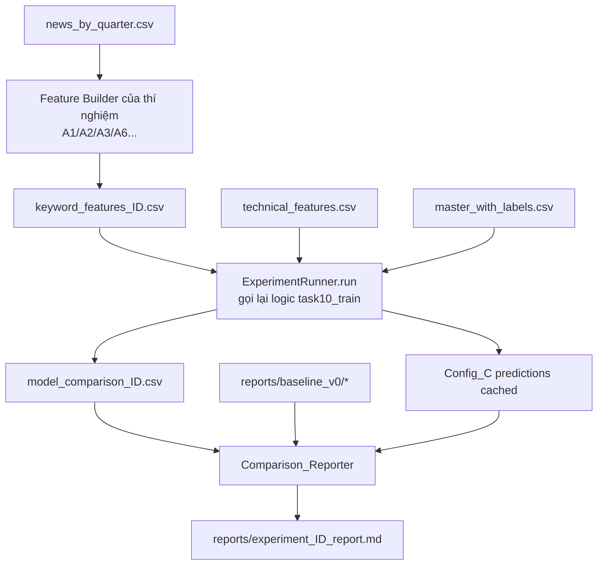

# Design Document

## Overview

Tính năng `text-feature-experiments` bổ sung một tầng thí nghiệm (experiment layer) lên trên
pipeline dự báo xu hướng giá HOSE-80 hiện có, mà **không sửa đổi hành vi mặc định** của
pipeline sản xuất (TASK 1–11). Mục tiêu là kiểm chứng hai hướng nghiên cứu:

- **Hướng A** (A1, A2, A3, A6, tùy chọn A4/A5): thử nhiều tầng biểu diễn văn bản tinh vi hơn
  tần suất từ khóa thô, để chứng minh kết quả âm (H1 không được ủng hộ) không phải do phương
  pháp đo lường yếu.
- **Hướng B** (B3, B1, tùy chọn B4/B5): tìm tín hiệu văn bản có điều kiện (theo ngành, vốn
  hóa, granularity cấp bài viết).

Nguyên tắc thiết kế cốt lõi, rút ra từ `docs/ke_hoach_trien_khai_A_B.md`:

1. **Config_A là hằng số đối chứng.** 16 đặc trưng kỹ thuật không bao giờ thay đổi giữa các
   thí nghiệm. Mỗi thí nghiệm chỉ thay đổi tập đặc trưng từ khóa (do đó thay đổi Config_B và
   Config_C).
2. **So sánh công bằng qua cùng một pipeline.** Mọi biến thể đặc trưng đi qua đúng
   `task10_train.py` (cùng 4 thuật toán, cùng hyperparameter, cùng `time_series_split`,
   cùng imputer fit-trên-train).
3. **Không rò rỉ dữ liệu thời gian.** `Train_Cutoff = 2025Q1` cố định; mọi đặc trưng cho
   `Period_q` chỉ dùng thông tin của `Period_q` hoặc các kỳ trước đó.
4. **Version hóa mọi artifact.** Mỗi thí nghiệm ghi ra `keyword_features_{id}.csv`,
   `model_comparison_{id}.csv`, và một báo cáo so sánh riêng, giữ nguyên baseline v0.
5. **Baseline v0 bất biến.** Kết quả cũ được đóng băng vào `reports/baseline_v0/` trước khi
   chạy bất kỳ thí nghiệm nào.

Tính năng được xây dựng như một tập các module Python độc lập trong thư mục mới `experiments/`,
tái sử dụng tối đa các hàm đã có của `task9_kw_features.py` và `task10_train.py`.

## Architecture

### Vị trí module — thư mục `experiments/`

Các thí nghiệm được đặt trong thư mục mới `experiments/` ở cấp workspace, tách biệt với
`pipeline/` (nơi chứa TASK sản xuất). Lý do:

- Giữ pipeline sản xuất sạch, không lẫn code thí nghiệm.
- `experiments/` import và tái sử dụng các hàm từ `pipeline/` như một thư viện.
- Các script mẫu hiện có (`pipeline/experiment_*.py`) sẽ tiếp tục hoạt động; các thí nghiệm
  mới đi theo cùng khuôn mẫu nhưng gom vào thư mục riêng có cấu trúc rõ ràng.

```
experiments/
├── __init__.py
├── common/
│   ├── __init__.py
│   ├── snapshot.py            # Baseline_Snapshotter (Req 1)
│   ├── runner.py              # ExperimentRunner: cầu nối tới task10_train (Req 14)
│   ├── reporting.py           # Comparison_Reporter (Req 13)
│   ├── segments.py            # sector/cap mapping (Req 10)
│   └── periods.py             # tiện ích ranh giới kỳ dùng chung (Req 4, 11)
├── feature_registry.py        # đăng ký prefix/suffix đặc trưng mới (Req 3)
├── a1_group_sentiment.py      # Sentiment_Aggregator (Req 6)
├── a2_negation.py             # Negation_Matcher (Req 5)
├── a3_velocity.py             # Velocity_Feature_Builder (Req 7)
├── a4_tfidf_crossticker.py    # TFIDF_CrossTicker_Builder (Req 9, tùy chọn)
├── a5_embeddings.py           # Embedding_Builder (Req 9, tùy chọn)
├── a6_llm_sentiment.py        # LLM_Annotator (Req 8)
├── b1_distant_supervision.py  # Distant_Supervision_Module (Req 11)
├── b3_segmentation.py         # Segmentation_Analyzer (Req 10)
├── b4_spillover.py            # Spillover_Builder (Req 12, tùy chọn)
├── b5_anomaly.py              # Anomaly_Detector (Req 12, tùy chọn)
└── run_experiment.py          # CLI orchestrator: --experiment A2 ...
```

### Luồng dữ liệu chung của một thí nghiệm

Mọi thí nghiệm loại A (tạo đặc trưng từ khóa mới) tuân theo cùng một luồng:



Điểm mấu chốt: `ExperimentRunner` là một wrapper mỏng quanh `run_model_training()` cho phép
truyền `kw_path` tùy biến (đường dẫn tới `keyword_features_{id}.csv`) và `comparison output
path` tùy biến, nhưng giữ nguyên toàn bộ logic huấn luyện. Điều này thỏa mãn Req 14 (so sánh
công bằng).

### Tái sử dụng `task10_train.py` để so sánh công bằng

`run_model_training()` hiện đã nhận tham số `tech_path`, `kw_path`, `labels_path`, `cutoff`.
Tuy nhiên nó hardcode `MODEL_COMPARISON_PATH` khi lưu và không trả về predictions để làm
McNemar. Thiết kế bổ sung một tham số tùy chọn mà **không phá vỡ chữ ký cũ**:

```python
def run_model_training(
    tech_path: str = TECH_FEATURES_PATH,
    kw_path: str = KW_FEATURES_PATH,
    labels_path: str = LABELS_PATH,
    cutoff: str = "2025Q1",
    comparison_path: str | None = None,       # MỚI: mặc định None → dùng MODEL_COMPARISON_PATH
    return_predictions: bool = False,          # MỚI: trả về dict predictions cho McNemar
) -> pd.DataFrame | tuple[pd.DataFrame, dict]:
```

Khi `comparison_path` là `None`, hành vi giữ nguyên như hiện tại (Req 14.1 — cùng pipeline).
`ExperimentRunner` gọi hàm này với `kw_path="data/features/keyword_features_A2.csv"` và
`comparison_path="reports/model_comparison_A2.csv"`.

`ExperimentRunner` cũng expose một hàm cấp thấp `run_configs_return_predictions()` tái dùng
`load_and_merge_data`, `identify_feature_columns`, `get_feature_configs`,
`time_series_split`, `fit_imputer`, `prepare_features` để lấy predictions của Config_A và
Config_C trên cùng tập test — cần cho McNemar (Req 13.4) và cho B3 (retrain theo phân khúc).

### Orchestration

`experiments/run_experiment.py` cung cấp CLI:

```
python -m experiments.run_experiment --experiment A2
python -m experiments.run_experiment --experiment A1a
python -m experiments.run_experiment --snapshot          # chạy Baseline_Snapshotter
python -m experiments.run_experiment --experiment B3 --report
```

CLI đảm bảo thứ tự: (1) snapshot baseline nếu chưa có, (2) build feature set, (3) chạy
runner, (4) chạy Comparison_Reporter. Nó không thay thế `pipeline/run_pipeline.py` mà chạy
song song.

## Components and Interfaces

### 1. Baseline_Snapshotter (`experiments/common/snapshot.py`) — Req 1

Đóng băng kết quả cũ vào `reports/baseline_v0/`.

```python
BASELINE_DIR = "reports/baseline_v0"
SNAPSHOT_FILES = [
    "model_comparison.csv",
    "keyword_significance.csv",
    "period_experiment.csv",
    "metrics_breakdown.csv",
    "news_density_analysis.csv",
    "shap_configc_keyword_ranking.csv",
]

def create_baseline_snapshot(
    reports_dir: str = "reports",
    baseline_dir: str = BASELINE_DIR,
    force: bool = False,
) -> SnapshotResult:
    """Copy each SNAPSHOT_FILES entry from reports/ into baseline_v0/.

    - Nếu baseline_dir đã có tệp và force=False → giữ nguyên, log "đã tồn tại" (Req 1.3).
    - Tệp nguồn thiếu → log cảnh báo, tiếp tục (Req 1.2).
    - Ghi manifest .snapshot_meta.json: ngày tạo + danh sách tệp đã copy (Req 1.4).
    """
```

`SnapshotResult` là dataclass: `copied: list[str]`, `missing: list[str]`,
`already_existed: bool`, `created_at: str`.

Lưu ý tên tệp: `shap_configc_keyword_ranking.csv` là tên tồn tại thực tế trong `reports/`
(đã xác nhận). Nếu một tệp nguồn không tồn tại (ví dụ chưa chạy SHAP), snapshotter cảnh báo
và bỏ qua thay vì fail.

### 2. Feature Registry (`experiments/feature_registry.py`) — Req 3

Nguồn chân lý duy nhất cho các prefix/suffix đặc trưng văn bản mới, dùng để mở rộng
`identify_feature_columns()`.

```python
# Các prefix của cột keyword mới (bổ sung cho kw_, kw_norm_, tfidf_ đã có)
NEW_KW_PREFIXES = (
    "sent_",        # A1: sentiment nhóm — sent_A, sent_B, ...
    "llm_",         # A6: llm_pos_ratio, llm_neg_ratio, llm_net_sentiment
    "ds_",          # B1: ds_pos_prob_mean, ds_net_sentiment
    "sector_",      # B4: sector_pos_score, sector_news_count
    "emb_",         # A5: embedding dims
    "tfidfx_",      # A4: cross-ticker tfidf
)

# Các cột keyword mới nhận diện bằng tên chính xác hoặc hậu tố
NEW_KW_EXACT = {
    "news_velocity", "kw_novelty", "kw_entropy",   # A3
    "pos_neg_shift", "news_spike",                  # A3, B5
}

# Hậu tố phủ định của A2: một cột kw gốc + "_NEG"
NEG_SUFFIX = "_NEG"

def is_keyword_column(col: str) -> bool:
    """True nếu col là cột đặc trưng văn bản (thuộc bất kỳ nhóm nào ở trên)."""
```

`identify_feature_columns()` trong `task10_train.py` được mở rộng để import registry này:

```python
from experiments.feature_registry import is_keyword_column  # import mềm, có fallback

def identify_feature_columns(df):
    meta_cols = {"ticker", "quarter_id", "label_basic"}
    kw_prefixes = ("kw_", "kw_norm_", "tfidf_")
    kw_exact = {"pos_score", "neg_score", "sentiment_ratio", "news_count",
                "news_count_log", "has_min_news", "combined_text"}
    tech_cols, kw_cols = [], []
    for col in df.columns:
        if col in meta_cols:
            continue
        is_kw = (
            col in kw_exact
            or any(col.startswith(p) for p in kw_prefixes)
            or _is_new_keyword_column(col)   # A2 _NEG, sent_, llm_, ds_, velocity...
        )
        (kw_cols if is_kw else tech_cols).append(col)
    return tech_cols, kw_cols
```

`_is_new_keyword_column` bọc `is_keyword_column` với xử lý hậu tố `_NEG` (một cột kết thúc
bằng `_NEG` và có tiền tố `kw_` được coi là keyword). Import mềm (try/except) đảm bảo
`task10_train` vẫn chạy độc lập nếu thư mục experiments vắng mặt — bảo toàn Req 14 và không
làm hỏng pipeline sản xuất.

Bất biến quan trọng (Req 3.6, 3.7): mọi cột không khớp bất kỳ quy tắc keyword nào và không
phải meta đều rơi vào technical → 16 đặc trưng kỹ thuật của Config_A luôn ổn định.

### 3. ExperimentRunner (`experiments/common/runner.py`) — Req 14

```python
@dataclass
class ExperimentConfig:
    experiment_id: str                 # "A2", "A1a", "B1", ...
    kw_features_path: str              # data/features/keyword_features_{id}.csv
    comparison_path: str               # reports/model_comparison_{id}.csv
    cutoff: str = "2025Q1"

def run_experiment_training(cfg: ExperimentConfig) -> RunnerResult:
    """Gọi run_model_training với kw_path/comparison_path tùy biến.
    Trả về RunnerResult chứa results_df và predictions của Config_A/Config_C
    trên cùng tập test (cho McNemar)."""
```

`RunnerResult`: `results_df: pd.DataFrame`, `test_index: pd.Index`,
`y_test: np.ndarray`, `pred_by_config: dict[str, np.ndarray]`.

### 4. Comparison_Reporter (`experiments/common/reporting.py`) — Req 13

Sinh báo cáo Markdown `reports/experiment_{id}_report.md` với đầy đủ 5 bước Phần C của kế
hoạch A_B.

```python
def generate_comparison_report(
    experiment_id: str,
    new_results: RunnerResult,
    baseline_dir: str = BASELINE_DIR,
    keyword_sig_path: str | None = None,   # reports/keyword_significance_{id}.csv nếu có
    shap_contrib_pct: float | None = None,  # % SHAP text nếu tính được
) -> str:
    """Tạo báo cáo gồm:
    1. Bảng Δ(C−A) 4 thuật toán, đặt cạnh baseline_v0 (Req 13.1)
    2. #keyword đạt BH-FDR vs 0/71 (Req 13.2)
    3. % đóng góp SHAP text vs 32% (Req 13.3)
    4. McNemar p-value: Config_C mới vs Config_C baseline (Req 13.4)
    5. Nhận xét H1/H2/H3 (Req 13.5)
    6. Phân tích 3 giải thích lý thuyết (Req 13.6)
    7. Kết luận vị trí trong luận văn (Req 13.7)
    """

def generate_text_representation_table(
    experiment_ids: list[str] = ["v0", "A2", "A1a", "A6"],
) -> str:
    """Bảng tổng hợp 4 tầng biểu diễn text (Req 13.8)."""
```

**McNemar giữa hai Config_C khác feature set (Req 13.4).** Đây là điểm tinh tế: McNemar cần
hai bộ dự đoán trên **cùng tập test và cùng thứ tự mẫu**. Vì Config_C baseline (v0) không lưu
predictions, Comparison_Reporter tái tạo predictions của v0 bằng cách chạy
`run_configs_return_predictions()` với `keyword_features.csv` gốc, rồi align theo
`(ticker, quarter_id)` với predictions của thí nghiệm mới trước khi lập bảng tương liên
correctness. Hàm McNemar tái dùng `statsmodels.stats.contingency_tables.mcnemar` (đúng như
`experiment_mcnemar.py`).

### 5. Negation_Matcher — A2 (`experiments/a2_negation.py`) — Req 5

Xem chi tiết thuật toán ở mục "Chi tiết thuật toán then chốt".

```python
NEGATION_CUES = [
    "không", "chưa", "chẳng", "chả", "không còn",
    "không thể", "khó", "thiếu", "mất",
]
# Lưu ý: "giảm", "hạ" KHÔNG nằm trong danh sách phủ định phủ nhận — chúng là
# từ chỉ hướng và đã được xử lý qua các cụm keyword trong KEYWORD_GROUPS.

NEGATION_WINDOW = 3   # ±3 từ (Req 5.2)

def compute_raw_counts_negation_aware(
    combined_text: str,
    keywords: list[str],
    negation_cues: list[str] = NEGATION_CUES,
    window: int = NEGATION_WINDOW,
) -> dict[str, int]:
    """Như compute_raw_counts (longest-first masking) nhưng khi một keyword
    khớp, kiểm tra cửa sổ ±window từ; nếu có cue phủ định → count vào
    'kw_{keyword}_NEG' thay vì 'kw_{keyword}' (Req 5.3)."""

def build_a2_features() -> pd.DataFrame:
    """Đọc news_by_quarter, dùng matcher trên, ghi keyword_features_A2.csv (Req 5.6),
    trả về thống kê % hit bị flip cho các keyword hay bị phủ định (Req 5.7)."""
```

### 6. Sentiment_Aggregator — A1 (`experiments/a1_group_sentiment.py`) — Req 6

```python
def compute_group_sentiment(
    df: pd.DataFrame,                 # đã có kw_norm_* (tái dùng compute_keyword_counts)
    keyword_groups: dict = KEYWORD_GROUPS,
) -> pd.DataFrame:
    """Với mỗi nhóm G ∈ {A..F}: sent_{G} = Σ kw_norm_(pos∈G) − Σ kw_norm_(neg∈G),
    đã chuẩn hóa theo news_count (Req 6.1, 6.2)."""

def build_a1a_features() -> pd.DataFrame:  # chỉ sent_* + coverage (Req 6.3)
def build_a1b_features() -> pd.DataFrame:  # raw kw_* + sent_* (Req 6.4)
```

### 7. Velocity_Feature_Builder — A3 (`experiments/a3_velocity.py`) — Req 7

```python
def build_velocity_features(
    news_by_quarter: pd.DataFrame,
) -> pd.DataFrame:
    """Tính, sắp theo (ticker, quarter_id) tăng dần:
    - news_velocity = (nc[q] − nc[q−1]) / (nc[q−1] + 1)      (Req 7.1)
    - kw_novelty    = #keyword lần đầu xuất hiện ở q của ticker (Req 7.2)
    - kw_entropy    = entropy phân phối kw trong q            (Req 7.3)
    - pos_neg_shift = sentiment_ratio[q] − sentiment_ratio[q−1] (Req 7.4)
    Tất cả chỉ dùng kỳ ≤ q (Req 7.5). Ghi keyword_features_A3.csv (Req 7.6)."""
```

### 8. LLM_Annotator — A6 (`experiments/a6_llm_sentiment.py`) — Req 8

```python
def annotate_articles(
    articles: pd.DataFrame,           # all_news_processed.csv (title, description, ticker, date)
    cache_path: str = "data/news/annotated/llm_sentiment.csv",
    model: str = "gemini-2.0-flash",
) -> pd.DataFrame:
    """Với mỗi bài chưa có trong cache: gọi Gemini Flash (temperature=0) hỏi
    sentiment {positive/negative/neutral} + confidence, prompt cấm dự đoán giá
    (Req 8.1–8.3). Ghi cache kèm content_hash, model_version, timestamp (Req 8.4).
    Bài đã có trong cache → dùng lại (Req 8.5). Lỗi API → log + tiếp tục (Req 8.8)."""

def aggregate_llm_features(
    annotations: pd.DataFrame,
    news_by_quarter_keys: pd.DataFrame,
) -> pd.DataFrame:
    """Gộp theo (ticker, quarter_id): llm_pos_ratio, llm_neg_ratio,
    llm_net_sentiment (Req 8.6). Ghi keyword_features_A6.csv (Req 8.7)."""
```

### 9. Segmentation_Analyzer — B3 (`experiments/b3_segmentation.py`) — Req 10

```python
def assign_segments() -> dict[str, SegmentInfo]:
    """Ánh xạ ticker → (sector, cap_group) từ experiments/common/segments.py."""

def run_segmentation_analysis(
    cutoff: str = "2025Q1",
) -> tuple[pd.DataFrame, pd.DataFrame]:
    """Với mỗi phân khúc (từng sector, và large-cap vs mid-cap):
    - lọc merged theo ticker ∈ phân khúc
    - retrain Config_A/B/C, tính Delta_CA (Req 10.3)
    - kiểm định keyword significance + BH-FDR trong phân khúc (Req 10.4)
    - báo cáo n mẫu mỗi phân khúc (Req 10.5)
    Ghi segmentation_analysis.csv + segmentation_keyword_sig.csv (Req 10.6)."""
```

### 10. Distant_Supervision_Module — B1 (`experiments/b1_distant_supervision.py`) — Req 11

Xem chi tiết ở mục thuật toán. Chữ ký chính:

```python
def build_noisy_labels(
    articles: pd.DataFrame,         # (ticker, date, text_tokenized)
    prices: pd.DataFrame,           # daily OHLCV per ticker
    threshold: float = 0.02,
) -> pd.DataFrame:
    """Với mỗi bài (t, d): return trong [d+1, d+3] ngày giao dịch, cắt tại ranh
    giới kỳ chứa d (Req 11.1, 11.5). Gán noisy_label pos/neg/neutral (Req 11.2–11.4)."""

def train_article_classifier(
    labeled_train_articles: pd.DataFrame,   # CHỈ bài thuộc kỳ < cutoff (Req 11.6)
) -> Pipeline:
    """TF-IDF + Logistic Regression trên text_tokenized → 3 lớp."""

def build_b1_features(
    classifier, all_articles, cutoff="2025Q1",
) -> pd.DataFrame:
    """Với mỗi (ticker, quarter_id): aggregate predict_proba CHỈ trên bài trong
    quarter đó → ds_pos_prob_mean, ds_net_sentiment (Req 11.7).
    Ghi keyword_features_B1.csv + distant_supervision_report.md với AUC (Req 11.8)."""
```

## Data Models

### `data/news/annotated/llm_sentiment.csv` (A6) — Req 8.4

| Cột | Kiểu | Mô tả |
|---|---|---|
| `content_hash` | str | SHA-256 của `title + "\n" + description` chuẩn hóa (khóa cache) |
| `ticker` | str | Mã cổ phiếu |
| `date` | str (ISO) | Ngày đăng bài |
| `title` | str | Tiêu đề bài (để truy vết) |
| `sentiment` | str | `positive` / `negative` / `neutral` |
| `confidence` | float | [0,1] mức tin cậy do LLM trả về |
| `model_version` | str | ví dụ `gemini-2.0-flash-001` |
| `temperature` | float | luôn `0.0` |
| `annotated_at` | str (ISO) | Dấu thời gian gọi API |

Tệp này được commit vào repo (Req 15.2) để đảm bảo tái lập.

### `data/features/keyword_features_{id}.csv` — Req 2

Mọi tệp đặc trưng thí nghiệm chia sẻ khung khóa `[ticker, quarter_id, ...]`, cùng schema
hợp nhất được (mergeable) với `technical_features.csv` và `master_with_labels.csv` trên
`(ticker, quarter_id)`. Cột đặc trưng khác nhau theo thí nghiệm:

| id | Cột đặc trưng đặc thù (ngoài news_count/coverage) |
|---|---|
| `A2` | `kw_*`, `kw_norm_*`, `tfidf_*` **+** `kw_{keyword}_NEG` cho các keyword bị đảo |
| `A1a` | `sent_A`, `sent_B`, `sent_C`, `sent_D`, `sent_E`, `sent_F` |
| `A1b` | tất cả `kw_*`/`kw_norm_*`/`tfidf_*` của v0 **+** `sent_A..F` |
| `A3` | `news_velocity`, `kw_novelty`, `kw_entropy`, `pos_neg_shift` (+ v0 base) |
| `A6` | `llm_pos_ratio`, `llm_neg_ratio`, `llm_net_sentiment` |
| `B1` | `ds_pos_prob_mean`, `ds_net_sentiment` |
| `A4` | `tfidfx_*` (cross-ticker) |
| `A5` | `emb_0 .. emb_{d-1}` |
| `B4` | `sector_pos_score`, `sector_news_count` |
| `B5` | `news_spike` |

### `reports/segmentation_analysis.csv` (B3) — Req 10.6

| Cột | Mô tả |
|---|---|
| `segment_type` | `sector` hoặc `cap_group` |
| `segment_name` | ví dụ `Banking`, `large_cap`, `mid_cap` |
| `n_samples` | số mẫu (ticker×quarter) trong phân khúc (Req 10.5) |
| `n_tickers` | số ticker trong phân khúc |
| `model` | thuật toán (4 dòng/phân khúc) |
| `ba_config_a` | balanced accuracy Config_A |
| `ba_config_c` | balanced accuracy Config_C |
| `delta_ca` | Δ(C−A) |

### `reports/segmentation_keyword_sig.csv` (B3) — Req 10.4

Cùng schema như `keyword_significance.csv` (keyword, direction, chi/mw/logit p_raw+p_adj,
significant_*) **cộng thêm** cột `segment_name` và `n_samples` để phân biệt phân khúc.

### `reports/distant_supervision_report.md` (B1) — Req 11.8

Báo cáo Markdown gồm: (a) phân phối noisy label (pos/neg/neutral); (b) AUC/accuracy của
article classifier trên noisy label ở cấp bài viết (macro-AUC one-vs-rest); (c) bảng
Δ(C−A) của B1 vs baseline; (d) granularity analysis (classifier có học được gì ở cấp bài
mà aggregation quý làm mờ không).

### `SegmentInfo` (in-memory, `experiments/common/segments.py`) — Req 10.1, 10.2

```python
@dataclass(frozen=True)
class SegmentInfo:
    ticker: str
    sector: str        # Banking, Securities, RealEstate, Industrial, Energy,
                       # Consumer, Technology, Transport
    cap_group: str     # "large_cap" (30 VN30 gốc) | "mid_cap" (50 HOSE-80 mở rộng)
```

Ánh xạ sector suy ra từ comment phân nhóm trong `config/pipeline_config.yaml` (Banking &
Finance, Securities, Real Estate, ...). `cap_group` suy ra từ vị trí ticker: 30 mã đầu là
VN30 (large-cap), 50 mã sau là mid-cap.

## Chi tiết thuật toán then chốt

### A2 — Negation-aware masking (thuật toán)

Mở rộng `compute_raw_counts` (đã có longest-first masking). Ý tưởng: **giữ nguyên bước
masking**, chỉ thêm bước kiểm tra phủ định *sau khi* một span khớp được xác định.

```
Đầu vào: text đã chuẩn hóa (lowercase, underscore→space); keywords
1. tokens ← text.split()   # để tính chỉ số từ cho cửa sổ ±3
2. Sắp keywords theo độ dài chuẩn hóa GIẢM DẦN (longest-first)
3. masked ← text
4. for kw in ordered:
5.     pattern ← normalize(kw)
6.     for mỗi vị trí khớp không chồng lấn của pattern trong masked:
7.         xác định span [start_char, end_char]
8.         word_lo, word_hi ← chỉ số từ bao quanh span
9.         window_tokens ← tokens[word_lo-3 : word_hi+3+1]
10.        negated ← any(cue in window_tokens for cue in NEGATION_CUES)
11.        if negated and not _already_negative(kw):   # Req 5.5 chống double-flip
12.            counts["kw_"+kw+"_NEG"] += 1
13.        else:
14.            counts["kw_"+kw] += 1
15.        mask span trong masked bằng sentinel   # giữ chống double-count (Req 5.4)
```

- `_already_negative(kw)`: True nếu kw thuộc danh sách `negative` của `KEYWORD_GROUPS` HOẶC
  đã chứa sẵn cue phủ định (ví dụ "không chia cổ tức", "lợi nhuận không tăng"). Với các
  keyword này, không đảo thêm (Req 5.5) — đếm theo polarity gốc.
- Masking (bước 15) chạy đúng như bản gốc để "lợi nhuận không tăng" không bị "tăng" đếm lại
  (Req 5.4 — negation check chạy trên span đã xác định bởi longest-first).
- Vì masking theo `str.replace` toàn cục cho `count()` occurrences, biến thể per-occurrence
  windowing được hiện thực bằng `re.finditer` trên bản masked hiện thời để lấy vị trí chính
  xác từng lần khớp trước khi mask.

### A3 & B1 — Ràng buộc thời gian (chống leakage)

Cả hai đều sắp xếp theo `quarter_id` tăng dần và chỉ dùng kỳ ≤ q:

- **A3 velocity/novelty/shift**: dùng `groupby("ticker")` rồi `shift(1)` trên chuỗi kỳ đã
  sort → `q−1` là quá khứ, hợp lệ. `kw_novelty` tại kỳ q dùng tập hợp keyword tích lũy của
  các kỳ *trước* q (expanding set, loại trừ q hiện tại khỏi "đã từng thấy").
- **B1 distant supervision**: (1) noisy label dùng return `[d+1, d+3]` nhưng **cắt tại ranh
  giới kỳ chứa d** — nếu d gần cuối kỳ, chỉ tính tới ngày giao dịch cuối của kỳ đó; (2)
  article classifier chỉ fit trên bài của các kỳ `< cutoff`; (3) feature cho kỳ q chỉ
  aggregate bài đăng trong kỳ q. Ba lớp bảo vệ này đảm bảo Req 11.5, 11.6, 11.7.

Ranh giới kỳ được tính bằng tiện ích chung `experiments/common/periods.py::quarter_bounds(quarter_id)`
trả về `(start_date, end_date)` của quý, và `clip_return_window(d, horizon, quarter_id)` cắt
cửa sổ return tại `end_date` của quý chứa d.

## Correctness Properties


*A property is a characteristic or behavior that should hold true across all valid executions
of a system — essentially, a formal statement about what the system should do. Properties
serve as the bridge between human-readable specifications and machine-verifiable correctness
guarantees.*

Các thí nghiệm chứa nhiều logic thuần (pure functions): phân loại cột đặc trưng, khớp phủ
định, công thức velocity/entropy/sentiment nhóm, gán nhãn theo ngưỡng, và các ràng buộc thời
gian chống rò rỉ. Đây là những thành phần rất phù hợp với property-based testing. Ngược lại,
phần gọi LLM (A6), sinh báo cáo (Req 13), copy tệp (Req 1), và huấn luyện mô hình end-to-end
được kiểm bằng unit/integration test (xem Testing Strategy).

### Property 1: Cột đặc trưng văn bản mới luôn thuộc nhóm keyword

*For any* DataFrame chứa hỗn hợp cột meta, cột kỹ thuật, và các cột đặc trưng văn bản mới
(hậu tố `_NEG`, tiền tố `sent_`, `llm_`, `ds_`, `sector_`, hoặc tên `news_velocity`,
`kw_novelty`, `kw_entropy`, `pos_neg_shift`, `news_spike`), `identify_feature_columns` SHALL
phân loại mọi cột đặc trưng văn bản đó vào nhóm keyword.

**Validates: Requirements 3.1, 3.2, 3.3, 3.4, 3.5, 3.7**

### Property 2: Bất biến của tập đặc trưng kỹ thuật Config_A

*For any* tập cột đặc trưng từ khóa tùy ý được thêm vào một tập 16 đặc trưng kỹ thuật cố
định, `identify_feature_columns` SHALL trả về đúng 16 đặc trưng kỹ thuật đó trong nhóm
technical, không thừa không thiếu — do đó Config_A không thay đổi giữa mọi thí nghiệm.

**Validates: Requirements 3.6, 14.2, 14.3**

### Property 3: Chia train/test giữ đúng thứ tự thời gian

*For any* tập `(ticker, quarter_id)` với ít nhất 4 quý sau cutoff, `time_series_split` SHALL
tạo hai tập sao cho mọi `quarter_id` trong tập train nhỏ hơn cutoff và mọi `quarter_id` trong
tập test lớn hơn hoặc bằng cutoff (không xáo trộn, không chồng lấn thời gian).

**Validates: Requirements 4.1**

### Property 4: Nhân quả theo kỳ — không rò rỉ tương lai

*For any* đặc trưng phụ thuộc kỳ (A3 `news_velocity`, `kw_novelty`, `kw_entropy`,
`pos_neg_shift`; B1 aggregation `ds_pos_prob_mean`, `ds_net_sentiment`) và bất kỳ `Period_q`
nào, việc thay đổi dữ liệu thuộc các kỳ có chỉ số thời gian lớn hơn q SHALL không làm thay
đổi giá trị đặc trưng đã tính cho q.

**Validates: Requirements 4.3, 4.4, 4.5, 7.5, 11.7**

### Property 5: Đảo polarity khi và chỉ khi có phủ định hợp lệ trong cửa sổ

*For any* văn bản và từ khóa, `compute_raw_counts_negation_aware` SHALL đếm lần khớp vào đặc
trưng `kw_{keyword}_NEG` khi và chỉ khi có một dấu hiệu phủ định trong cửa sổ 3 từ trước hoặc
sau vị trí khớp VÀ từ khóa đó chưa mang sẵn nghĩa phủ định; ngược lại lần khớp được đếm vào
`kw_{keyword}` gốc.

**Validates: Requirements 5.2, 5.3, 5.5**

### Property 6: Bảo toàn số đếm — phủ định không gây đếm trùng

*For any* văn bản, tổng số lần đếm gộp giữa các đặc trưng gốc và đặc trưng `_NEG` của cùng
một từ khóa SHALL bằng đúng số lần khớp mà longest-first masking gốc tạo ra cho từ khóa đó;
một span đã khớp SHALL không bị một từ khóa con (substring) đối nghịch đếm lại.

**Validates: Requirements 5.4**

### Property 7: Công thức điểm sentiment theo nhóm

*For any* tập giá trị `kw_norm_*` của một `(ticker, Period_q)`, với mỗi nhóm chủ đề G, giá
trị `sent_{G}` SHALL bằng tổng `kw_norm` của các từ khóa tích cực trong G trừ tổng `kw_norm`
của các từ khóa tiêu cực trong G (đã chuẩn hóa theo news_count), và SHALL tăng đơn điệu theo
đóng góp tích cực khi giữ nguyên đóng góp tiêu cực.

**Validates: Requirements 6.1, 6.2**

### Property 8: Công thức velocity và pos_neg_shift

*For any* chuỗi kỳ đã sắp xếp của một ticker với `news_count` và `sentiment_ratio` cho trước,
`news_velocity[q]` SHALL bằng `(news_count[q] − news_count[q−1]) / (news_count[q−1] + 1)` và
`pos_neg_shift[q]` SHALL bằng `sentiment_ratio[q] − sentiment_ratio[q−1]` với kỳ liền trước
theo thứ tự thời gian.

**Validates: Requirements 7.1, 7.4**

### Property 9: Cận của kw_entropy

*For any* phân phối tần suất từ khóa trong một kỳ, `kw_entropy` SHALL bằng 0 khi toàn bộ khối
lượng tập trung ở một từ khóa duy nhất, và SHALL đạt giá trị lớn nhất khi phân phối đều trên
các từ khóa có mặt; giá trị luôn không âm.

**Validates: Requirements 7.3**

### Property 10: Nhất quán tỷ lệ sentiment từ LLM

*For any* tập nhãn LLM của một `(ticker, Period_q)` có ít nhất một bài, các tỷ lệ
`llm_pos_ratio`, `llm_neg_ratio` và tỷ lệ neutral SHALL cộng lại bằng 1, và `llm_net_sentiment`
SHALL bằng `llm_pos_ratio − llm_neg_ratio`.

**Validates: Requirements 8.6**

### Property 11: Ánh xạ phân khúc phủ toàn bộ và duy nhất

*For any* danh sách ticker cấu hình, `assign_segments` SHALL gán cho mỗi ticker đúng một
ngành và đúng một nhóm vốn hóa thuộc `{large_cap, mid_cap}`, sao cho hợp của các phân khúc
phủ toàn bộ tập ticker và không ticker nào thuộc hai nhóm vốn hóa.

**Validates: Requirements 10.1, 10.2**

### Property 12: Gán nhãn nhiễu theo ngưỡng ±2%

*For any* giá trị suất sinh lời cửa sổ ngắn hạn, `build_noisy_labels` SHALL gán `positive`
khi suất sinh lời ≥ +2%, `negative` khi ≤ −2%, và `neutral` khi nằm giữa hai ngưỡng đó.

**Validates: Requirements 11.2, 11.3, 11.4**

### Property 13: Cửa sổ suất sinh lời bị cắt trong ranh giới kỳ

*For any* bài viết đăng ngày giao dịch d về ticker t, tập các ngày giao dịch dùng để tính
suất sinh lời `[d+1, d+3]` SHALL nằm hoàn toàn trong kỳ `Period_q` chứa ngày d; việc thay đổi
giá của các kỳ sau `Period_q` SHALL không làm thay đổi nhãn nhiễu của bài viết đó.

**Validates: Requirements 11.1, 11.5**

### Property 14: Bộ phân loại chỉ học trên bài của giai đoạn train

*For any* tập bài viết trải qua nhiều kỳ, tập bài dùng để huấn luyện bộ phân loại sentiment
cấp bài viết SHALL chỉ gồm các bài đăng trong các kỳ có chỉ số thời gian nhỏ hơn Train_Cutoff.

**Validates: Requirements 11.6**

### Property 15: Nhất quán mã thí nghiệm giữa các artifact

*For any* `experiment_id` hợp lệ, các đường dẫn đầu ra của thí nghiệm (tệp đặc trưng, tệp kết
quả huấn luyện, tệp báo cáo) SHALL cùng nhúng đúng một `experiment_id` đó.

**Validates: Requirements 2.1, 2.2, 2.4**

## Error Handling

- **Baseline_Snapshotter (Req 1.2, 1.3):** tệp nguồn thiếu → ghi cảnh báo nêu tên tệp và tiếp
  tục; baseline đã tồn tại → không ghi đè, log thông báo. Không ném exception cho các trường
  hợp này để việc đóng băng luôn hoàn tất được phần có thể.
- **LLM_Annotator (Req 8.8):** mỗi lời gọi API bọc trong try/except. Lỗi (timeout, rate
  limit, parse) → ghi bài lỗi vào log kèm `content_hash`, gán sentiment `neutral`/confidence 0
  hoặc bỏ qua khỏi aggregation, và tiếp tục bài kế. Có retry với backoff cho lỗi tạm thời.
  Cache đảm bảo chạy lại chỉ xử lý bài còn thiếu.
- **Distant_Supervision (Req 11):** ticker thiếu dữ liệu giá, hoặc cửa sổ `[d+1,d+3]` rơi vào
  cuối kỳ không còn ngày giao dịch → bài đó không sinh được nhãn nhiễu, bị loại khỏi tập huấn
  luyện classifier (ghi log số bài bị loại). Khi một kỳ không có bài nào, feature `ds_*` cho
  kỳ đó là NaN (giữ nguyên, không impute — imputer của pipeline xử lý sau).
- **Model_Trainer guard (đã có):** merged rỗng hoặc chỉ một lớp nhãn → ném `ValueError` với
  thông báo rõ ràng. Áp dụng nguyên cho mọi thí nghiệm.
- **Segmentation (Req 10.5):** phân khúc có quá ít mẫu (một lớp nhãn, hoặc < ngưỡng tối thiểu)
  → bỏ qua huấn luyện phân khúc đó nhưng vẫn báo cáo n mẫu và ghi chú "insufficient power".
- **Feature registry import mềm:** nếu `experiments/` không khả dụng khi chạy pipeline sản
  xuất, `identify_feature_columns` fallback về quy tắc gốc (try/except quanh import) — pipeline
  không bao giờ vỡ vì thiếu module thí nghiệm.

## Testing Strategy

### Cách tiếp cận kép

- **Unit tests (example/edge/smoke):** kiểm hành vi cụ thể, ranh giới, và cấu hình.
- **Property-based tests:** kiểm 15 correctness property trên nhiều đầu vào sinh ngẫu nhiên.

Cả hai bổ trợ nhau (Req 15.1, 15.4). Toàn bộ test mới đặt trong `tests/experiments/`.

### Property-based testing

- **Thư viện:** dùng **Hypothesis** (Python) — không tự cài đặt PBT. Đã phù hợp với hệ sinh
  thái pytest hiện có.
- **Số vòng lặp:** mỗi property test cấu hình tối thiểu **100 iterations**
  (`@settings(max_examples=100)`).
- **Tag:** mỗi property test gắn comment tham chiếu design property theo định dạng
  **Feature: text-feature-experiments, Property {number}: {property_text}**.
- **Một property ⇔ một property test.** Ánh xạ:
  - P1, P2 → `test_feature_registry_pbt.py` (sinh tên cột hỗn hợp).
  - P3 → `test_time_split_pbt.py`.
  - P4 → `test_period_causality_pbt.py` (metamorphic: mutate kỳ > q, khẳng định bất biến; áp
    cho cả A3 và B1 aggregation).
  - P5, P6 → `test_negation_pbt.py` (sinh văn bản có/không cue trong cửa sổ; kiểm bảo toàn số
    đếm với cặp keyword substring đối nghịch).
  - P7 → `test_group_sentiment_pbt.py`.
  - P8, P9 → `test_velocity_pbt.py`.
  - P10 → `test_llm_aggregate_pbt.py` (sinh nhãn giả, không gọi API).
  - P11 → `test_segments_pbt.py`.
  - P12, P13, P14 → `test_distant_supervision_pbt.py` (sinh chuỗi giá + ngày đăng; kiểm cắt
    cửa sổ trong kỳ và ràng buộc train pre-cutoff).
  - P15 → `test_experiment_ids_pbt.py`.

**Generators tùy biến (nhấn mạnh edge cases từ prework):**
- Văn bản tiếng Việt: sinh chuỗi token gồm keyword, cue phủ định, và từ đệm; đảm bảo phủ ký
  tự non-ASCII, khoảng trắng thừa, và cặp keyword substring đối nghịch (Property 5, 6).
- Suất sinh lời quanh biên ±2% chính xác (Property 12).
- Bài đăng vào ngày giao dịch cuối kỳ để ép nhánh cắt cửa sổ (Property 13).

### Unit tests (example / edge / smoke)

- **A2 (5.7), A1 (6.5):** báo cáo % flip / số lượng đặc trưng — assert giá trị trên ví dụ nhỏ.
- **A6 cache (8.5):** mock lclient LLM; chạy hai lần; assert API chỉ gọi cho bài chưa cache và
  số dòng cache ổn định (idempotence, đếm số lần gọi). Prompt/temperature (8.1–8.3) kiểm bằng
  mock assert tham số truyền vào.
- **Baseline_Snapshotter (1.1–1.4):** dùng thư mục tạm; kiểm copy, cảnh báo tệp thiếu, không
  ghi đè, metadata json.
- **B3 (10.3–10.6):** chạy trên fixture nhỏ nhiều ticker/phân khúc; assert Δ(C−A) và n mẫu ghi
  đúng, BH-FDR tái dùng hàm đã kiểm thử.
- **Comparison_Reporter (13.x):** assert báo cáo chứa bảng Δ(C−A) 4 thuật toán, mốc `0/71`,
  `32%`, và p-value McNemar; kiểm alignment predictions theo `(ticker, quarter_id)`.
- **Smoke (15.2, 15.4):** assert `llm_sentiment.csv` được commit và ghi model version; chạy
  toàn bộ suite để xác nhận không giảm số test đang pass.

### Integration tests

- **A6 end-to-end với mock LLM:** chạy annotate → aggregate → runner trên fixng nhỏ, xác nhận
  luồng sinh `keyword_features_A6.csv` và merge được với pipeline.
- **ExperimentRunner (14.1):** assert runner gọi `run_model_training` với đúng cùng thuật
  toán/hyperparameter/split như baseline (so khớp tham số model).
