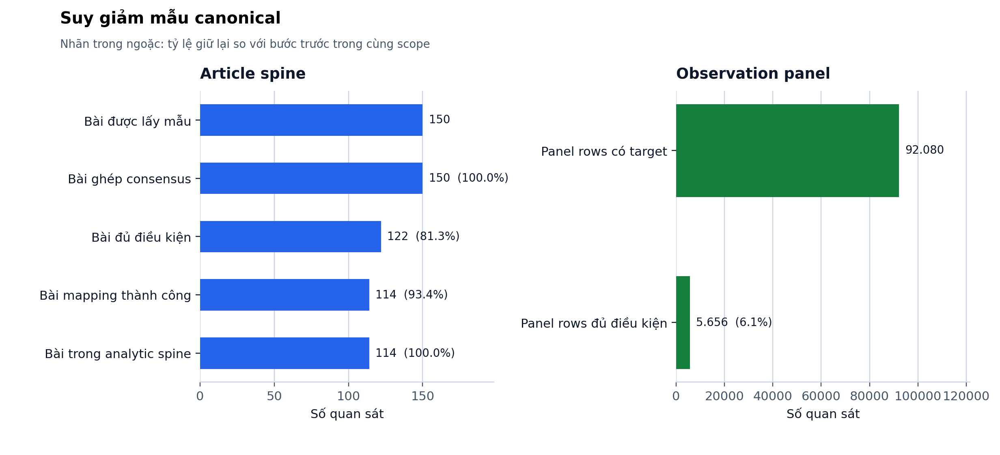
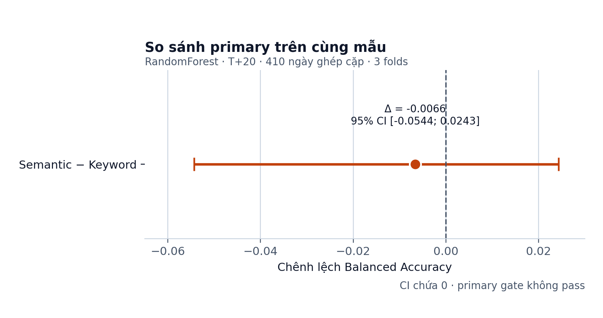

# LUẬN VĂN FINAL — CANONICAL SUBMISSION

## Hệ thống hỗ trợ quyết định cổ phiếu dựa trên tín hiệu học máy và bằng chứng tin tức ngữ nghĩa có truy vết

**English title:** *Evidence-Grounded Stock Decision Support Using Machine Learning Signals and Semantic News Materiality*  
**Học viên:** Ngô Minh Trí  
**Mã số học viên:** 24C01024  
**Ngành:** Khoa học Dữ liệu — 8460108  
**Đơn vị:** Trường Đại học Khoa học Tự nhiên, Đại học Quốc gia Thành phố Hồ Chí Minh

> Bản Markdown này là nguồn luận văn trong canonical submission bundle. Bảng kết quả same-sample phải được sinh từ `canonical_results/canonical_summary.json`; không nhập tay số chưa có artifact.

> Công trình phục vụ nghiên cứu học thuật. Không phải khuyến nghị đầu tư, công cụ giao dịch tự động, cam kết lợi nhuận hoặc bằng chứng nhân quả.

---

## LỜI CAM ĐOAN

Tôi cam đoan luận văn trình bày đúng phạm vi dữ liệu, phương pháp và artifact được lưu trong repository. Nhãn do mô hình tạo và hợp nhất được gọi là pseudo-label. Kết quả event-window được diễn giải là liên hệ quan sát. Kết quả Top-K/backtest là mô phỏng thăm dò. Mọi kết luận same-sample phải truy được tới run ID, protocol hash và structured output.

## LỜI CẢM ƠN

Tôi cảm ơn giảng viên hướng dẫn, các thầy cô và những người đã góp ý về thiết kế dữ liệu, temporal validation, leakage control và cách báo cáo kết quả âm. Tôi cảm ơn cộng đồng nguồn mở và các nhà cung cấp mô hình đã hỗ trợ prototype. Mọi sai sót còn lại thuộc trách nhiệm của tác giả.

---

## TÓM TẮT

Luận văn xây dựng hệ thống hỗ trợ phân tích cổ phiếu Việt Nam kết hợp tín hiệu ML, tin tức tài chính, semantic materiality, evidence pack và constrained LLM decision card. Trọng tâm không phải dự báo hoặc giao dịch tự động mà là một decision record có thể truy vết qua `select → explain → monitor → update → review`.

Đóng góp phương pháp chính là canonical keyword–semantic comparison. Khác các thí nghiệm lịch sử dùng unit, target và split khác nhau, comparison mới bắt buộc keyword và semantic dùng cùng article spine, observation rows, khoảng thời gian, target outperform T+20 so với VNINDEX, ba target-exit-aware expanding folds, model, metrics và matched Top-K assumptions. Primary record được khóa trước run: `B_technical_coverage_keyword` so với `C_technical_coverage_semantic`, Random Forest, Balanced Accuracy. Canonical run có 5.656 eligible panel rows, 64.818 predictions và 410 paired dates đủ minimum class count. Primary delta là -0,006610, 95% CI [-0,054367; 0,024299], BH-adjusted p-value 0,869896; gate không pass. Vì vậy chưa có đủ bằng chứng semantic cải thiện keyword trong primary setting.

Semantic layer dùng consensus pseudo-label, không phải human ground truth. Event study, decision-card rubric và EvidenceTrace được đánh giá ở các lớp claim riêng: association, card quality và traceability. Kết quả legacy quarterly/daily/period-material không được đặt cạnh canonical metrics như cùng một benchmark. Luận văn báo cáo cả kết quả âm, undefined và not-estimable.

**Từ khóa:** học máy; cổ phiếu Việt Nam; keyword; semantic materiality; point-in-time; evidence pack; LLM; decision support; traceability.

## ABSTRACT

This thesis develops an evidence-grounded decision-support system for Vietnamese stocks using machine-learning signals, financial news, semantic materiality, evidence packs, and constrained LLM decision cards. Its objective is not autonomous prediction or trading, but an auditable decision record covering selection, explanation, monitoring, updating, and outcome review.

The main methodological contribution is a canonical keyword–semantic comparison. Keyword and semantic representations share the exact article spine, observation rows, time scope, VNINDEX-adjusted T+20 target, target-exit-aware expanding folds, models, metrics, and matched Top-K assumptions. The canonical run contains 5,656 eligible panel rows, 64,818 predictions, and 410 paired dates satisfying the minimum class count. For the Random-Forest Balanced-Accuracy comparison fixed in the executable contract before the canonical rerun, the semantic-minus-keyword delta is -0.006610, with a 95% CI of [-0.054367, 0.024299] and a BH-adjusted p-value of 0.869896. The primary gate fails; semantic superiority is therefore not supported in this setting.

Semantic consensus labels remain pseudo-labels rather than human ground truth. Event association, decision-card rubric quality, and interface traceability are evaluated as separate claim layers. Legacy experiments with different units, targets, splits, or universes are not directly compared with canonical metrics. Negative, undefined, and non-estimable results are retained.

**Keywords:** machine learning; Vietnamese stocks; keyword representation; semantic materiality; point-in-time evaluation; evidence grounding; LLM; decision support; traceability.

---

# CHƯƠNG 1. GIỚI THIỆU

## 1.1. Bối cảnh

Thị trường chứng khoán tạo đồng thời dữ liệu OHLCV có cấu trúc và lượng lớn tin tức phi cấu trúc. Technical features mô tả return, momentum, volatility, liquidity và trend; chúng phù hợp mô hình bảng nhưng không giải thích đầy đủ bối cảnh doanh nghiệp. Tin tức chứa earnings, debt, capital, governance, legal và project events, nhưng độ liên quan và materiality không thể suy ra đáng tin chỉ từ số lần xuất hiện từ khóa.

Hệ thống phân tích cần trả lời không chỉ “xác suất tăng là bao nhiêu” mà còn “evidence nào hỗ trợ hoặc phản biện, risk nào cần theo dõi, và outcome sau holding period có phù hợp thesis ban đầu không”. Vì vậy luận văn tập trung vào decision record và provenance.

## 1.2. Vấn đề nghiên cứu

Keyword counting dễ tái lập nhưng thiếu phủ định, context, entity role, materiality và evidence span. LLM semantic extraction tạo schema giàu hơn nhưng có pseudo-label, provider drift, correlated errors và hallucination risk. Quan trọng hơn, so sánh hai representation chỉ có ý nghĩa khi chúng dùng cùng dữ liệu và phương pháp đánh giá.

Repository trước đây chứa quarterly keyword, daily semantic, period-material và technical backtest tracks. Chúng dùng unit, target, split hoặc universe khác nhau. So sánh trực tiếp score giữa các track sẽ sai phương pháp. Canonical study khắc phục bằng executable same-sample contract.

## 1.3. Mục tiêu

1. Đánh giá keyword và semantic trên cùng article spine và ML timeline.
2. Xây semantic evidence schema có provenance.
3. Kiểm soát future leakage bằng conservative effective-date mapping và target-exit purge.
4. Đánh giá paired OOS classification và matched Top-K.
5. Xây evidence pack, decision card, monitoring và outcome review tách biệt.
6. Tạo submission bundle có claim–evidence matrix và checksums.

## 1.4. Câu hỏi nghiên cứu

- RQ1: Keyword có incremental value ngoài technical và coverage không?
- RQ2: Semantic có incremental value ngoài technical và coverage không?
- RQ3: Semantic có cải thiện keyword trên đúng cùng rows/folds/target/model không?
- RQ4: Materiality và direction liên hệ adjusted return ở horizon nào?
- RQ5: Full-evidence cards có tốt hơn ML-only/rule cards trong cùng rubric condition không?
- RQ6: EvidenceTrace có duy trì point-in-time lineage không?

## 1.5. Đóng góp

- Executable harmonized comparison protocol.
- Common article spine và exact alignment gates.
- Target-exit-aware temporal validation.
- Separation giữa predictive, association, card-quality và traceability claims.
- Fail-closed artifact governance và reproducible submission bundle.

## 1.6. Phạm vi và non-claims

Không claim universal LLM improvement, stable alpha, causal effect, human ground truth, deployment readiness hoặc investment advice.

---

# CHƯƠNG 2. CƠ SỞ LÝ THUYẾT VÀ NGHIÊN CỨU LIÊN QUAN

## 2.1. ML chuỗi thời gian tài chính

Random split làm trộn quá khứ và tương lai. Expanding folds và purge theo target exit giảm overlap giữa train outcomes và test decision dates; temporal cross-validation cần giữ cấu trúc phụ thuộc của chuỗi [1]. Balanced Accuracy phù hợp khi class prevalence thay đổi; AUC đo ranking, không đồng nghĩa economic value. Calibration, Brier và log loss bổ sung góc nhìn xác suất.

## 2.2. Keyword representation

Keyword counts và TF-IDF có ưu điểm minh bạch nhưng dễ đếm sai phủ định và bỏ qua subject relevance. Financial text còn có nghĩa từ vựng khác general-domain text [2]. Full-sample IDF có thể gây transductive leakage trong strict point-in-time evaluation. Canonical study chỉ dùng curated context-aware counts; không dùng full-sample TF-IDF.

## 2.3. Semantic materiality

Schema tách ticker relevance, materiality, direction, event type, uncertainty, novelty, reasoning confidence và evidence span. Domain-adapted language models như FinBERT cho thấy giá trị của representation theo miền tài chính [3]. Semantic output trong luận văn vẫn được coi là weak supervision/pseudo-label [4]; agreement giữa annotators/models không biến output thành truth.

## 2.4. Event study

VNINDEX-adjusted event returns, bootstrap CI [5] và BH-FDR [6] hỗ trợ exploratory association analysis. Chúng không xử lý đầy đủ confounding, clustered events hoặc causal identification.

## 2.5. Evidence-grounded LLM

LLM phù hợp extraction và constrained generation nhưng có hallucination và prompt sensitivity. Guardrails gồm schema cố định, evidence references, recursive outcome stripping, initial/review physical separation và explicit uncertainty.

## 2.6. Decision support và traceability

Giá trị hệ thống nằm ở khả năng tổ chức evidence, risk, triggers, lineage và review. Card đẹp nhưng không có provenance hoặc chứa future outcome không đạt yêu cầu nghiên cứu.

## 2.7. Khoảng trống

Khoảng trống không phải thiếu thêm model, mà thiếu một comparison trong đó keyword và semantic chịu cùng sample, timeline, target, folds, model và economic assumptions.

---

# CHƯƠNG 3. DỮ LIỆU VÀ PHƯƠNG PHÁP

## 3.1. Kiến trúc

```text
OHLCV → lagged technical features ───────────┐
                                             ├→ shared OOS ML → rank/Top-K
News → common article spine → keyword ───────┤
                            → semantic ──────┘
                                             ↓
                                      evidence pack
                                             ↓
                          rule / ML-only / full-evidence card
                                             ↓
                               monitor → update → review
```

## 3.2. Dữ liệu

Canonical inputs gồm stock prices, VNINDEX, quarterly technical features, 150-article sample và consensus pseudo-label artifact. Input hashes được khóa trong `harmonized_comparison_v5.json`.

## 3.3. Article spine

Sample và consensus outer-join bằng `(news_id, ticker)` rồi bắt buộc one-to-one keys và content-hash equality. Article unannotated, ineligible hoặc mapping-failed không được biến thành semantic zero. Keyword và semantic đọc cùng analytic spine.

## 3.4. Point-in-time mapping

Do source sample chủ yếu có ngày nhưng không có giờ đáng tin, policy bảo thủ ánh xạ bài sang strict next ticker trading session. Mapping errors được giữ trong attrition audit. Chỉ `mapping_status == ok` đi vào features.

## 3.5. Target

Trên mỗi stock entry session, target exit là benchmark session thứ 20. Stock và VNINDEX returns dùng exact cùng entry/exit dates. `label_outperform_T20 = 1` khi stock return trừ benchmark return lớn hơn 0. Không forward-fill stock exit.

## 3.6. Feature configurations

| Config | Technical | Coverage | Keyword | Semantic |
|---|---:|---:|---:|---:|
| A | Có | Không | Không | Không |
| E | Có | Có | Không | Không |
| B | Có | Có | Có | Không |
| C | Có | Có | Không | Có |
| D | Có | Có | Có | Có |

B và C dùng shared technical/coverage columns; chỉ text family khác nhau.

## 3.7. Temporal split

Ba expanding folds tạo một lần từ canonical panel. Mọi config/model dùng cùng train/test indices. Train target exits phải trước test start. Không fallback split.

## 3.8. Models

Primary Random Forest [7]: 300 trees, max depth 6, minimum leaf 5, balanced classes, seed 42. Logistic Regression là robustness. Imputation/scaling fit train-only. SHAP thuộc lớp giải thích model legacy và được diễn giải theo framework additive feature attribution [8].

## 3.9. Primary comparison và inference

```text
P1: B_technical_coverage_keyword
 vs C_technical_coverage_semantic
RandomForest / balanced_accuracy
```

Block bootstrap và sign-flip/permutation dùng 10.000 draws; BH-FDR áp theo family đã cố định trong executable contract trước canonical rerun. Primary gate chỉ đọc đúng một record.

## 3.10. Matched Top-K

Primary K=10, equal weight, T+20 non-overlap, cost `0.005 × turnover`. Candidate universe, dates và exits phải giống nhau giữa B và C. Không đủ periods tạo `not_estimable`.

## 3.11. Các lớp đánh giá khác

- Semantic quality: annotation coverage, agreement, rule comparison, evidence span và error taxonomy.
- Event study: adjusted returns theo materiality/direction.
- Decision cards: rule, ML-only và full-evidence trong từng judge condition.
- Traceability: initial/monitor/review separation, hashes, source IDs và case audit.

---

# CHƯƠNG 4. KẾT QUẢ

## 4.1. Canonical sample attrition

Canonical run `canonical_150_v7` bắt đầu từ 150 bài, join đủ 150 bài với consensus, có 122 bài analysis-eligible và 114 bài vừa eligible vừa map được theo effective-date policy. Analytic article spine cuối gồm 114 bài. Target panel có 92.080 rows tính được target; sau yêu cầu coverage và lagged technical availability còn 5.656 rows đủ điều kiện modeling. Bảng máy sinh nằm tại `artifacts/tables/canonical_results_generated.md`; source duy nhất là `canonical_results/canonical_summary.json`.



## 4.2. Primary same-sample keyword–semantic comparison

Primary record dùng Random Forest và Balanced Accuracy trên đúng cùng 410 paired dates đủ minimum class count thuộc ba folds. Semantic trừ keyword có delta `-0,006610`, 95% block-bootstrap CI `[-0,054367; 0,024299]`, raw p-value `0,745625` và BH-adjusted p-value `0,869896`. Coverage/fold audits đều pass nhưng confidence interval chứa 0 và p-value BH lớn hơn 0,05; primary gate **không pass**.

Kết luận đúng phạm vi: trong common stratified article spine và protocol T+20 đã cố định trong executable contract trước canonical rerun, chưa có đủ bằng chứng rằng semantic representation cải thiện keyword representation về Balanced Accuracy. Kết quả không chứng minh semantic evidence vô ích cho extraction, error taxonomy, decision cards hoặc traceability.



## 4.3. Secondary comparisons

A/E/B/C/D và Logistic Regression là sensitivity. Chúng không được dùng để thay primary result sau khi quan sát outcome. Mọi cell phải đọc từ `canonical_results/tables/harmonized_inference.csv`; không chọn post-hoc model/metric dương làm headline.

## 4.4. Matched Top-K

Matched Top-K có 22 non-overlap periods cho K=5 và 9 periods cho K=10 ở cả hai models. Với primary Random Forest, K=10 semantic trừ keyword có mean net-return delta `0,000300` và mean net-excess-return delta `0,000300`. Artifact ghi chỉ một fold đóng góp vào matched K=10 periods, nên confidence interval, sign-flip p-value và BH-adjusted p-value đều không khả dụng (`not_estimable_in_pilot`). Vì vậy point estimate chỉ mang tính mô tả, không hỗ trợ economic superiority và không được gọi alpha. Source: `canonical_results/backtest/harmonized_topk_matched_deltas.csv` và `canonical_results/tables/harmonized_inference.csv`.

## 4.5. Semantic extraction quality

Existing artifacts ghi 150 consensus rows, 122 analysis-eligible trước temporal mapping, 40 unanimous, 106 majority vote và 4 disagreement. Rule baseline yếu ở direction, event type và materiality. Kết quả cho thấy keyword/rule representation thiếu context, nhưng consensus vẫn là pseudo-label.

## 4.6. Event association

Trong tám event-window tests hiện có, materiality high/medium so với low tại T+5 là test duy nhất đạt strict positive gate: adjusted-return difference 0,0223, BH-adjusted p-value 0,0457 và CI [0,0091; 0,0366]. Kết quả là exploratory association.

## 4.7. Decision-card quality

Existing artifacts gồm 25 evidence packs, rule cards, ML-only cards và full-evidence cards. Trong từng automated judge condition, full-evidence thường mạnh hơn ML-only về faithfulness, hallucination control và risk articulation. Không so absolute scores giữa provider/judge khác nhau; không diễn giải thành tăng return.

## 4.8. Traceability

EvidenceTrace tách `select`, `initial`, `monitor`, `update`, `review`, `semantic` và `evaluation`. Initial pack loại outcome fields; review pack lưu realized outcomes. Hashes, decision IDs và source IDs hỗ trợ audit.

## 4.9. Legacy evidence

Quarterly keyword, daily semantic, period-material sweep, B1 và technical-only backtest cũ nằm trong `governance/legacy_artifact_registry.md`. Chúng không phải direct comparator của canonical run.

---

# CHƯƠNG 5. THẢO LUẬN

## 5.1. Ý nghĩa same-sample design

Exact same-row comparison loại một nguồn phản biện quan trọng: score khác nhau do sample, target hoặc split thay đổi. B/C alignment cho phép quy chênh lệch cho representation family trong giới hạn model và sample đã khóa.

## 5.2. Diễn giải kết quả primary

Primary gate fail. Point estimate semantic trừ keyword gần 0; confidence interval rộng và cắt qua 0; BH-adjusted p-value 0,869896. Do đó H3 không được hỗ trợ trong canonical sample. Luận văn không chuyển sang secondary cell để cứu giả thuyết. Kết quả này không quyết định semantic layer vô ích trong evidence organization, vì predictive value khác representation quality, card quality và traceability.

## 5.3. Predictive value khác evidence value

Semantic schema có thể hữu ích cho traceability, risk articulation và monitoring dù incremental BA bằng 0. Prediction, association, card quality và traceability là bốn outcomes khác nhau.

## 5.4. Threats to validity

### Internal validity

Publication time ambiguity, article boilerplate, ticker mismatch, lag granularity và model assumptions.

### Construct validity

Outperform T+20 và BA không bao phủ toàn bộ mục tiêu đầu tư. Pseudo-label không đo semantic truth.

### External validity

Stratified sample nhỏ; universe và market regime giới hạn; chưa full-corpus replication.

### Statistical conclusion validity

Power thấp, dependent dates và multiple tests. Block inference/BH giảm nhưng không loại hết rủi ro.

## 5.5. Hạn chế deployment

Không có production auth/RBAC, complete live data validation, liquidity model, paper trading hoặc independent human evaluation.

## 5.6. Giá trị khoa học của negative findings

Keyword không ổn định hoặc primary gate fail vẫn giúp loại representation/claim không đủ bằng chứng. Fail-closed reporting mạnh hơn chọn post-hoc cell dương.

---

# CHƯƠNG 6. KẾT LUẬN VÀ HƯỚNG PHÁT TRIỂN

## 6.1. Kết luận

Luận văn xây dựng pipeline kết hợp technical ML, keyword/semantic news, evidence packs, constrained decision cards và EvidenceTrace. Đóng góp quan trọng nhất là chuyển comparison từ các track không đồng nhất sang một canonical contract có cùng sample, target, folds, model và backtest. Mọi claim được gắn evidence, gate và limitation.

## 6.2. Hướng phát triển

1. Independent expert labels và blinded human card evaluation.
2. Full-corpus replication dùng protocol được commit/tag trước khi chạy.
3. Accurate publication timestamps và market-session calendar.
4. Point-in-time universe membership và delisting audit.
5. Richer transaction costs, liquidity và paper trading.
6. Independent generator/judge providers và repeated-run stability.
7. Production-grade EvidenceTrace với auth, DB, accessibility và live-source validation.

---

# TÀI LIỆU THAM KHẢO

[1] Bergmeir, C., Hyndman, R. J., & Koo, B. (2018). A note on the validity of cross-validation for evaluating autoregressive time series prediction. *Computational Statistics & Data Analysis, 120*, 70–83. https://doi.org/10.1016/j.csda.2017.11.003

[2] Loughran, T., & McDonald, B. (2011). When is a liability not a liability? Textual analysis, dictionaries, and 10-Ks. *The Journal of Finance, 66*(1), 35–65. https://doi.org/10.1111/j.1540-6261.2010.01625.x

[3] Araci, D. (2019). FinBERT: Financial sentiment analysis with pre-trained language models. *arXiv preprint arXiv:1908.10063*. https://arxiv.org/abs/1908.10063

[4] Ratner, A., Bach, S. H., Ehrenberg, H., Fries, J., Wu, S., & Ré, C. (2017). Snorkel: Rapid training data creation with weak supervision. *Proceedings of the VLDB Endowment, 11*(3), 269–282. https://doi.org/10.14778/3157794.3157797

[5] Efron, B., & Tibshirani, R. J. (1993). *An Introduction to the Bootstrap*. Chapman & Hall/CRC. https://doi.org/10.1201/9780429246593

[6] Benjamini, Y., & Hochberg, Y. (1995). Controlling the false discovery rate: A practical and powerful approach to multiple testing. *Journal of the Royal Statistical Society: Series B (Methodological), 57*(1), 289–300. https://doi.org/10.1111/j.2517-6161.1995.tb02031.x

[7] Breiman, L. (2001). Random forests. *Machine Learning, 45*, 5–32. https://doi.org/10.1023/A:1010933404324

[8] Lundberg, S. M., & Lee, S.-I. (2017). A unified approach to interpreting model predictions. *Advances in Neural Information Processing Systems, 30*. https://proceedings.neurips.cc/paper/2017/hash/8a20a8621978632d76c43dfd28b67767-Abstract.html

Các nguồn trên hỗ trợ lựa chọn phương pháp nền tảng; chúng không thay thế provenance của dữ liệu và artifacts thực nghiệm trong bundle.

---

# PHỤ LỤC

## Phụ lục A — Evaluation protocol

`canonical_results/evaluation_manifest.json`

## Phụ lục B — Run manifest và hashes

`canonical_results/run_manifest.json`  
`governance/checksums.sha256`

## Phụ lục C — Data dictionary

`governance/data_dictionary.md`

## Phụ lục D — Claim–evidence matrix

`governance/claim_evidence_matrix.md`

## Phụ lục E — Limitations và non-claims

`governance/limitations.md`

## Phụ lục F — Legacy registry

`governance/legacy_artifact_registry.md`

## Phụ lục G — Reproduction

`reproduction/README.md`

## Phụ lục H — Artifact status conventions

`ok`, `undefined`, `not_estimable`, `blocked`; không thay trạng thái thiếu bằng số 0.
