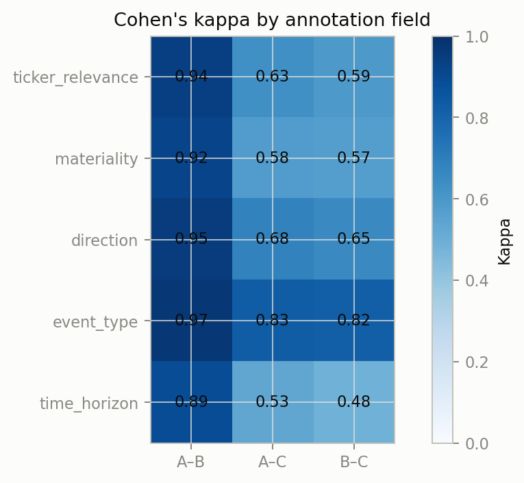
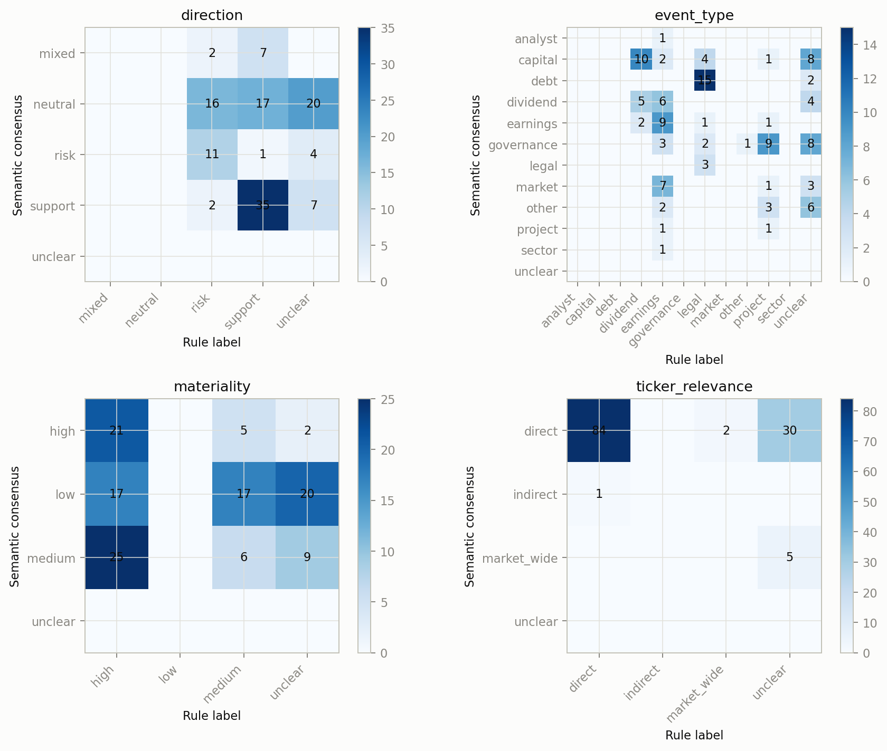
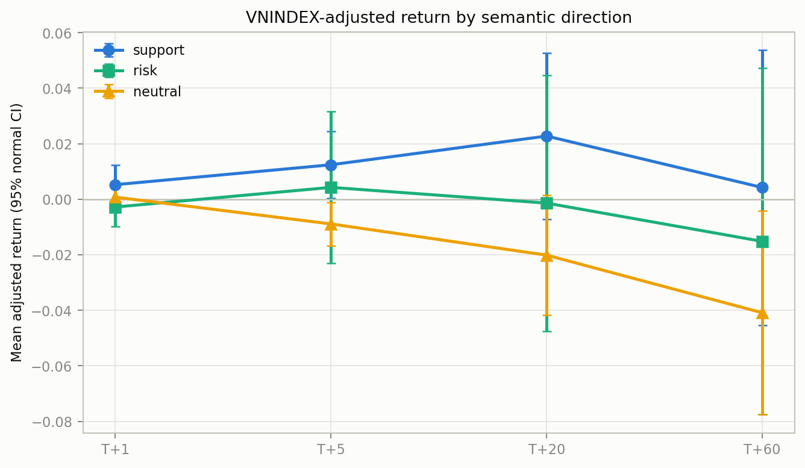
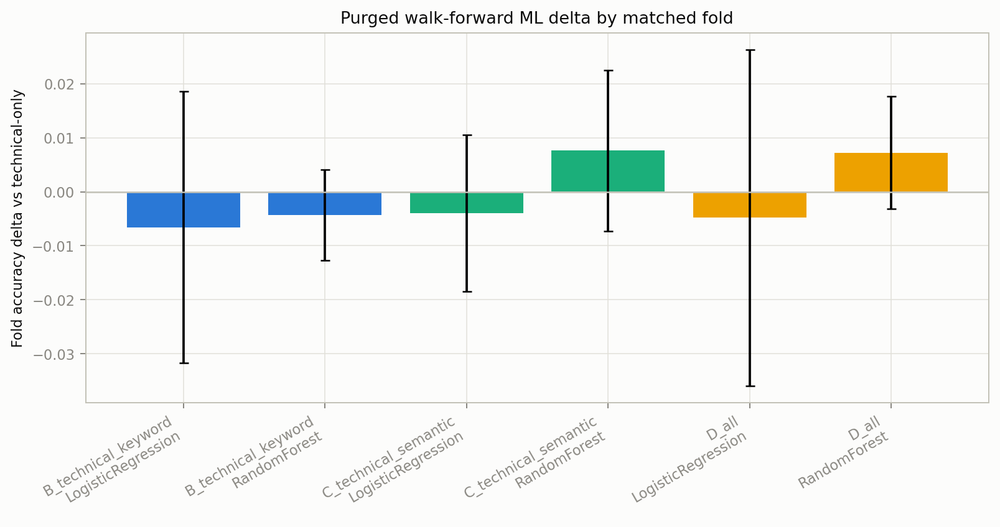
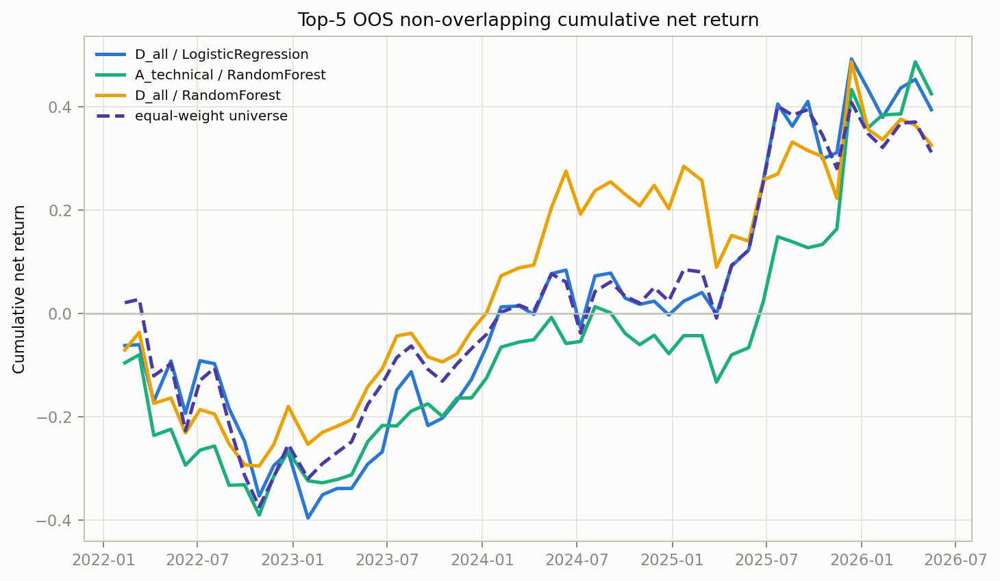

# ĐẠI HỌC QUỐC GIA TP. HỒ CHÍ MINH

## TRƯỜNG ĐẠI HỌC KHOA HỌC TỰ NHIÊN

### [PLACEHOLDER: TÊN KHOA/BỘ MÔN CHÍNH THỨC]

<br>

# LUẬN VĂN THẠC SĨ

## ĐÁNH GIÁ ĐẶC TRƯNG TIN TỨC CÓ XÉT ĐỘ LIÊN QUAN VÀ TRỌNG YẾU TRONG PHÂN TÍCH CỔ PHIẾU VIỆT NAM

**Tên tiếng Anh:** *Evaluating Relevance- and Materiality-Aware News Features for Vietnamese Stock Analysis*  

**Học viên:** Ngô Minh Trí  
**Mã số học viên:** 24C01024  
**Chuyên ngành:** Khoa học Dữ liệu  
**Mã ngành:** 8460108  
**Giảng viên hướng dẫn:** [PLACEHOLDER: HỌ TÊN, HỌC HÀM/HỌC VỊ GIẢNG VIÊN HƯỚNG DẪN]

TP. Hồ Chí Minh, [PLACEHOLDER: THÁNG] năm 2026

---

# LỜI CAM ĐOAN

[PLACEHOLDER: Học viên bổ sung lời cam đoan theo mẫu chính thức của cơ sở đào tạo.]

Họ tên: [PLACEHOLDER: HỌ VÀ TÊN HỌC VIÊN]  
Ngày: [PLACEHOLDER: NGÀY KÝ]  
Chữ ký: [PLACEHOLDER: CHỮ KÝ]

# LỜI CẢM ƠN

[PLACEHOLDER: Học viên bổ sung lời cảm ơn, tên đơn vị và cá nhân liên quan.]

# XÁC NHẬN CỦA GIẢNG VIÊN HƯỚNG DẪN

[PLACEHOLDER: Nội dung xác nhận theo mẫu chính thức.]

(Ký tên và ghi rõ họ tên)

# TÓM TẮT

Luận văn nghiên cứu cách biểu diễn tin tức chứng khoán Việt Nam bằng các thuộc tính ngữ nghĩa có ngữ cảnh, gồm mức độ liên quan tới mã cổ phiếu, tính trọng yếu, loại sự kiện, chiều tác động, chân trời thời gian và đoạn bằng chứng. Động cơ nghiên cứu xuất phát từ hạn chế của biểu diễn dựa trên từ khóa: một từ có thể xuất hiện trong tin thị trường chung, thông tin thủ tục, nội dung lặp hoặc sự kiện doanh nghiệp thực sự đáng chú ý, nhưng phép đếm đơn giản không phân biệt được các trường hợp đó. Trọng tâm của luận văn vì vậy là chất lượng biểu diễn thông tin, không phải xây dựng hệ thống khuyến nghị hay chứng minh khả năng sinh lợi.

Từ 52.790 bản ghi tin ban đầu, quy trình loại trùng theo URL, băm nội dung và tiêu đề lần lượt còn 45.968, 44.462 và 43.198 bản ghi; 150 bài được chọn theo phân tầng để gán nhãn. Ba lượt gán nhãn thuộc hai họ mô hình tạo 150 bản consensus, trong đó 122 bản đủ điều kiện phân tích; 40 bản nhất trí hoàn toàn, 106 bản theo đa số và 4 bản bất đồng. Tỷ lệ thiếu đoạn bằng chứng là 8,67%. Kiểm tra thủ công thí điểm bao gồm 24 dòng nhưng không có dòng nào mang provenance của reviewer; do đó đây chỉ là cầu nối kiểm soát chất lượng nhỏ, không phải nhãn chuẩn của con người. <!-- TRACE: multi_llm_evidence_extraction/reports/sample_selection_summary.md; multi_llm_evidence_extraction/reports/annotation_agreement_report.md; multi_llm_evidence_extraction/reports/manual_sanity_check_report.md -->

So sánh rule với pseudo-label semantic trên n=122 cho thấy độ khớp thấp, nhất là loại sự kiện và tính trọng yếu. Trong tám kiểm định hậu sự kiện, chỉ chênh lệch lợi suất điều chỉnh thị trường T+5 giữa nhóm trọng yếu cao/trung bình và thấp vượt cổng kết hợp: chênh lệch 0,0223, khoảng tin cậy 95% [0,0091; 0,0366], p hiệu chỉnh Benjamini–Hochberg 0,0457. Không kiểm định nào trong bốn placebo trước sự kiện vượt cổng. Đây là liên hệ thăm dò trong thiết kế quan sát, không phải tác động nhân quả. <!-- TRACE: multi_llm_evidence_extraction/reports/rule_vs_semantic_labels_report.md; multi_llm_evidence_extraction/reports/event_window_stat_tests_report.md; multi_llm_evidence_extraction/reports/placebo_pre_event_tests_report.md -->

Thử nghiệm máy học có 685.704 dự báo ngoài mẫu, ba fold và khoảng purge 20 ngày giao dịch. Các chỉ số tuyệt đối gần mức ngẫu nhiên, còn chênh lệch ghép cặp nhỏ và không nhất quán. Mô phỏng Top-K có 2.592 dòng và 54 kỳ; chỉ 3/16 cấu hình có p empirical một phía dưới 0,05 trước điều chỉnh đa kiểm định, cùng 64 dòng nhạy cảm chi phí. Outcome review gồm 114 trường hợp: 29 aligned, 24 opposed, 61 unavailable; salience là 54/53/7 và toàn bộ 114 trường hợp chưa đánh giá attribution. <!-- TRACE: multi_llm_evidence_extraction/reports/ml_outperform_experiment_report.md; multi_llm_evidence_extraction/reports/topk_backtest_with_cost_report.md; multi_llm_evidence_extraction/reports/outcome_review_report.md -->

Kết quả đóng góp một quy trình có thể truy vết để mô tả và kiểm tra biểu diễn ngữ nghĩa của tin tức. Pseudo-label không được xem là ground truth; liên hệ sự kiện không được diễn giải nhân quả; kết quả ML và Top-K không hỗ trợ tuyên bố alpha, khuyến nghị đầu tư hay lợi ích đối với người dùng.

**Từ khóa:** tin tức tài chính tiếng Việt; tính trọng yếu; mức độ liên quan; pseudo-label; weak supervision; kiểm định sự kiện; truy vết bằng chứng.

# ABSTRACT

This thesis studies a contextual semantic representation of Vietnamese stock-market news through ticker relevance, materiality, event type, direction, time horizon, and evidence spans. The motivation is that keyword counts cannot reliably distinguish market-wide commentary, procedural disclosures, duplicated boilerplate, and company-specific events with potentially meaningful financial implications. The thesis therefore focuses on information representation quality rather than recommendation generation or profitability claims.

Starting from 52,790 news records, URL, content-hash, and title deduplication reduced the corpus to 45,968, 44,462, and 43,198 records, respectively; 150 stratified articles were selected for annotation. Three annotation runs from two model families yielded 150 consensus records, of which 122 were analysis-eligible: 40 unanimous, 106 majority-vote, and 4 disagreement records. Evidence spans were missing in 8.67% of records. A 24-row pilot manual check had zero reviewer-backed rows and is therefore treated only as a small quality-control bridge, not validated human reference data. <!-- TRACE: multi_llm_evidence_extraction/reports/sample_selection_summary.md; multi_llm_evidence_extraction/reports/annotation_agreement_report.md; multi_llm_evidence_extraction/reports/manual_sanity_check_report.md -->

Rule labels showed weak agreement with semantic pseudo-labels on n=122, especially for event type and materiality. Among eight post-event tests, only the T+5 market-adjusted-return difference between high/medium- and low-materiality groups passed the joint gate: difference 0.0223, 95% CI [0.0091, 0.0366], Benjamini–Hochberg adjusted p=0.0457. None of four pre-event placebo tests passed. This is an exploratory observational association, not a causal effect. <!-- TRACE: multi_llm_evidence_extraction/reports/rule_vs_semantic_labels_report.md; multi_llm_evidence_extraction/reports/event_window_stat_tests_report.md; multi_llm_evidence_extraction/reports/placebo_pre_event_tests_report.md -->

The machine-learning experiment produced 685,704 out-of-sample predictions across three folds with a 20-trading-day purge. Absolute performance remained near random, while paired deltas were small and inconsistent. The Top-K simulation contained 2,592 rows over 54 periods; only 3 of 16 configurations reached nominal one-sided empirical p-values below 0.05 before multiplicity adjustment, alongside 64 cost-sensitivity rows. Among 114 retrospective outcome reviews, direction was aligned/opposed/unavailable in 29/24/61 cases; salience was 54/53/7, and attribution was unassessed in all 114 cases. <!-- TRACE: multi_llm_evidence_extraction/reports/ml_outperform_experiment_report.md; multi_llm_evidence_extraction/reports/topk_backtest_with_cost_report.md; multi_llm_evidence_extraction/reports/outcome_review_report.md -->

The contribution is a traceable workflow for describing and auditing semantic news representations. Pseudo-labels are not ground truth; event-window associations are not causal; and the ML and Top-K findings do not support claims of alpha, investment recommendations, or demonstrated user utility.

**Keywords:** Vietnamese financial news; materiality; ticker relevance; pseudo-labeling; weak supervision; event study; evidence traceability.

# DANH MỤC TỪ VIẾT TẮT

| Viết tắt | Nội dung |
|---|---|
| AI | Artificial Intelligence — trí tuệ nhân tạo |
| AUC | Area Under the ROC Curve |
| BH | Benjamini–Hochberg |
| CI | Confidence Interval — khoảng tin cậy |
| FDR | False Discovery Rate |
| F1 | Trung bình điều hòa giữa precision và recall |
| LLM | Large Language Model — mô hình ngôn ngữ lớn |
| M&A | Mergers and Acquisitions — mua bán và sáp nhập |
| ML | Machine Learning — học máy |
| OOS | Out-of-sample — ngoài mẫu |
| QC | Quality Control — kiểm soát chất lượng |
| RQ | Research Question — câu hỏi nghiên cứu |
| SHA256 | Secure Hash Algorithm 256-bit |
| Top-K | K quan sát có điểm xếp hạng cao nhất |

# DANH MỤC BẢNG

1. Bảng 1.1. Câu hỏi nghiên cứu và ranh giới suy luận.
2. Bảng 2.1. Khác biệt giữa biểu diễn từ khóa và biểu diễn ngữ nghĩa.
3. Bảng 3.1. Funnel chọn mẫu tin tức.
4. Bảng 3.2. Rubric nhãn ngữ nghĩa.
5. Bảng 3.3. Thiết kế thực nghiệm theo câu hỏi nghiên cứu.
6. Bảng 4.1. Kết quả consensus và điều kiện phân tích.
7. Bảng 4.2. Agreement giữa các lượt gán nhãn.
8. Bảng 4.3. Rule so với pseudo-label semantic.
9. Bảng 4.4. Kiểm định cửa sổ sự kiện.
10. Bảng 4.5. Placebo trước sự kiện.
11. Bảng 4.6. Tóm tắt walk-forward ML.
12. Bảng 4.7. Kết quả mô phỏng Top-K.
13. Bảng 4.8. Outcome review.
14. Bảng 5.1. Ledger giới hạn diễn giải.

# DANH MỤC HÌNH

1. Hình 4.1. Bản đồ nhiệt agreement giữa các lượt gán nhãn.
2. Hình 4.2. Ma trận nhầm lẫn rule và semantic pseudo-label.
3. Hình 4.3. Lợi suất điều chỉnh thị trường theo cửa sổ sự kiện.
4. Hình 4.4. So sánh walk-forward giữa các cấu hình ML.
5. Hình 4.5. Đường giá trị tích lũy ngoài mẫu của mô phỏng Top-K.

# MỤC LỤC

- [Tóm tắt](#tóm-tắt)
- [Abstract](#abstract)
- [Chương 1. Giới thiệu](#chương-1-giới-thiệu)
- [Chương 2. Cơ sở lý thuyết và công trình liên quan](#chương-2-cơ-sở-lý-thuyết-và-công-trình-liên-quan)
- [Chương 3. Dữ liệu và phương pháp nghiên cứu](#chương-3-dữ-liệu-và-phương-pháp-nghiên-cứu)
- [Chương 4. Kết quả thực nghiệm](#chương-4-kết-quả-thực-nghiệm)
- [Chương 5. Thảo luận](#chương-5-thảo-luận)
- [Chương 6. Kết luận](#chương-6-kết-luận)
- [Tài liệu tham khảo](#tài-liệu-tham-khảo)
- [Phụ lục A–K](#phụ-lục-a--k)

# CHƯƠNG 1. GIỚI THIỆU

## 1.1. Bối cảnh nghiên cứu

Tin tức tài chính là nguồn dữ liệu giàu nội dung nhưng khó chuẩn hóa. Cùng một mã cổ phiếu có thể xuất hiện trong báo cáo kết quả kinh doanh, thông báo chia cổ tức, tin pháp lý, bài tổng hợp thị trường hoặc danh sách hàng chục mã tăng giảm. Nếu mọi lần xuất hiện đều trở thành một tín hiệu tương đương, đặc trưng tin tức sẽ trộn thông tin trực tiếp với nhắc đến phụ, sự kiện có khả năng thay đổi kỳ vọng tài chính với tin thủ tục, và chiều tác động rõ với nội dung hỗn hợp.

Các nghiên cứu dự báo thị trường bằng văn bản cho thấy thông tin ngôn ngữ có thể bổ sung cho dữ liệu giá, nhưng kết quả phụ thuộc mạnh vào chất lượng nguồn, thời điểm, target và biểu diễn (Schumaker & Chen, 2009; Bollen, Mao, & Zeng, 2011; Nassirtoussi et al., 2014). Trong tiếng Việt, mô hình ngôn ngữ tiền huấn luyện như PhoBERT mở rộng khả năng xử lý văn bản (Nguyen & Nguyen, 2020), song có mô hình tốt không tự động giải quyết câu hỏi một bài viết có thật sự liên quan đến doanh nghiệp hay đủ trọng yếu để đưa vào phân tích hay không.

Luận văn tiếp cận khoảng trống đó bằng schema semantic-news. LLM được dùng như công cụ gán nhãn và trích xuất trong điều kiện thiếu tập nhãn người quy mô lớn. Vai trò này phải được giới hạn: đầu ra là pseudo-label có provenance và bất định, không phải sự thật chuẩn. Học máy và mô phỏng xếp hạng được dùng để kiểm tra tín hiệu thứ cấp, không làm trung tâm định vị nghiên cứu.

## 1.2. Vấn đề nghiên cứu

Biểu diễn rule/keyword có ba thiếu hụt chính. Thứ nhất, sự xuất hiện của từ hoặc mã không cho biết quan hệ là `direct`, `indirect`, `market_wide` hay `irrelevant`. Thứ hai, từ ngữ tích cực hoặc tiêu cực không đo quy mô và khả năng thay đổi kỳ vọng doanh thu, lợi nhuận, tài sản, nợ, dòng tiền hoặc rủi ro pháp lý. Thứ ba, phép đếm thiếu đoạn bằng chứng để người đọc kiểm tra lý do gán nhãn.

Vấn đề thực nghiệm là xác định liệu schema có thể tạo representation ổn định và truy vết được; liệu representation semantic khác rule ra sao; liệu các nhóm semantic có liên hệ với cửa sổ kết quả; và liệu bổ sung semantic features tạo chênh lệch ngoài mẫu hay mô phỏng xếp hạng đáng ghi nhận. Mọi câu trả lời phải giữ null findings và phân biệt association, prediction, simulation với causal inference hoặc utility.

## 1.3. Mục tiêu nghiên cứu

Mục tiêu tổng quát là đánh giá cách biểu diễn tin tức tài chính tiếng Việt bằng `ticker_relevance`, `materiality`, `event_type`, `direction`, `time_horizon` và `evidence_span` trong pipeline có thể kiểm toán.

Mục tiêu cụ thể:

1. Xây dựng rubric và protocol pseudo-labeling có schema, provenance, consensus và cờ review.
2. Mô tả agreement, disagreement, sensitivity theo họ mô hình và QC thủ công thí điểm.
3. So sánh rule labels với semantic pseudo-label reference.
4. Kiểm tra liên hệ giữa nhóm semantic và lợi suất điều chỉnh thị trường, kèm BH-FDR, bootstrap CI và placebo trước sự kiện.
5. Đánh giá chênh lệch classification/ranking bằng purged walk-forward OOS.
6. Kiểm tra mô phỏng Top-K với random null và transaction-cost sensitivity.
7. Xây dựng chuỗi truy vết từ claim đến evidence artifact và outcome review hồi cứu.

## 1.4. Câu hỏi nghiên cứu

**Bảng 1.1. Câu hỏi nghiên cứu và ranh giới suy luận**

| RQ | Câu hỏi | Bằng chứng chính | Ranh giới |
|---|---|---|---|
| RQ-SM1 | Rule/keyword bỏ sót ngữ cảnh nào? | So sánh n=122, taxonomy lỗi | Reference là pseudo-label |
| RQ-SM2 | Schema và protocol có ổn định, truy vết được không? | Agreement, consensus, evidence span, QC | 3 runs nhưng chỉ 2 families |
| RQ-SM3 | Semantic labels có liên hệ với outcome windows không? | 8 event tests, 4 placebo tests | Quan sát, không nhân quả |
| RQ-SM4 | Semantic features có chênh lệch predictive/ranking không? | Purged OOS, paired/bootstrap delta | Hiệu năng gần ngẫu nhiên là kết quả hợp lệ |
| RQ-SM5 | Top-K có khác random null và bền với chi phí không? | 54 periods, 16 null comparisons, 64 cost rows | Mô phỏng, không alpha |
| RQ-SM6 | Evidence và outcome review hỗ trợ truy vết kỹ thuật không? | Claim ledger, hashes, 114 reviews | Không đo utility người dùng |

*Nguồn: `multi_llm_evidence_extraction/de_cuong_chi_tiet_multi_llm_evidence_extraction.md`; `multi_llm_evidence_extraction/reports/claim_vs_evidence_table.md`.*

## 1.5. Giả thuyết nghiên cứu

- **H-SM1:** Hiệu quả hạn chế của keyword/news-count có liên hệ với việc không biểu diễn đầy đủ relevance, materiality, direction và event type; đây là giả thuyết liên hệ, không phải khẳng định nguyên nhân duy nhất.
- **H-SM2:** Protocol semantic tạo mức consistency và technical traceability mô tả được, nhưng agreement không đồng nghĩa correctness.
- **H-SM3:** Một số contrast semantic có thể liên hệ với lợi suất điều chỉnh thị trường; bằng chứng chỉ được chấp nhận khi qua cổng BH-FDR và bootstrap CI.
- **H-SM4:** Semantic features có thể tạo chênh lệch classification/ranking ngoài mẫu so với baseline, nhưng null hoặc near-random result vẫn là kết quả hợp lệ.
- **H-SM5:** Một số cấu hình Top-K có thể khác empirical random null sau chi phí; kết quả không được diễn giải thành alpha nếu thiếu robustness độc lập.
- **H-SM6:** Evidence span, provenance và lineage tăng technical traceability; nghiên cứu không kiểm định user utility.

## 1.6. Đóng góp

Đóng góp thứ nhất là ontology vận hành phù hợp với tin chứng khoán Việt Nam, tách mức độ liên quan, tính trọng yếu, loại sự kiện, chiều tác động và chân trời thời gian. Đóng góp thứ hai là protocol gán nhãn có consensus, evidence span, provenance và sensitivity theo family. Đóng góp thứ ba là đánh giá nhiều tầng, từ representation agreement đến event association, predictive delta, ranking simulation và retrospective outcome audit. Đóng góp thứ tư là ledger giới hạn claim nhằm ngăn kết quả kỹ thuật bị nâng thành phát biểu nhân quả, sinh lợi hoặc lợi ích sử dụng.

## 1.7. Phạm vi

Phạm vi thực nghiệm là tập tin tức và dữ liệu giá trong repository, với mẫu gán nhãn 150 bài. Luận văn không thiết lập benchmark nhãn người quy mô lớn, không đánh giá trải nghiệm người dùng, không triển khai tư vấn đầu tư và không kiểm định chiến lược trong giao dịch thật. Các kết quả phụ thuộc corpus, schema, protocol, target và thời kỳ hiện có.

## 1.8. Cấu trúc luận văn

Chương 2 trình bày nền tảng; Chương 3 mô tả dữ liệu và phương pháp; Chương 4 báo cáo kết quả; Chương 5 thảo luận ý nghĩa và giới hạn; Chương 6 kết luận. Phụ lục A–K lưu rubric, protocol, audit và thông số chi tiết.

# CHƯƠNG 2. CƠ SỞ LÝ THUYẾT VÀ CÔNG TRÌNH LIÊN QUAN

## 2.1. Thị trường hiệu quả và thông tin

Fama (1970) đặt nền tảng cho thảo luận về mức độ giá phản ánh thông tin. Trong luận văn này, nền tảng đó không được dùng để suy ra phản ứng giá là bằng chứng trực tiếp về giá trị hoặc nguyên nhân của một bài báo. Giá đồng thời phản ánh nhiều luồng thông tin, kỳ vọng và điều kiện thị trường. Vì vậy, outcome window chỉ cung cấp phép đối chiếu bên ngoài có điều kiện.

## 2.2. Đặc trưng kỹ thuật và học máy

Chỉ báo kỹ thuật tóm tắt xu hướng, động lượng và biến động từ chuỗi giá (Murphy, 1999). Random Forest tạo baseline phi tuyến dựa trên tập hợp cây (Breiman, 2001). Những mô hình này phù hợp để kiểm tra giá trị gia tăng có điều kiện của keyword hoặc semantic features: so sánh A kỹ thuật với B kỹ thuật+từ khóa, C kỹ thuật+semantic và D tổng hợp. Mục tiêu không phải tìm kiến trúc tối ưu mà là audit xem representation mới có tạo delta ổn định hay không.

## 2.3. Văn bản tài chính và dự báo thị trường

Schumaker và Chen (2009) nghiên cứu breaking financial news; Bollen et al. (2011) xem xét tâm trạng từ mạng xã hội; Nassirtoussi et al. (2014) tổng quan text mining cho dự báo thị trường. Các công trình cho thấy văn bản có thể chứa tín hiệu nhưng cũng làm rõ tính nhạy với lựa chọn mẫu, nhãn, cửa sổ và cách đánh giá. Luận văn chuyển trọng tâm từ câu hỏi “tin có dự báo giá không” sang câu hỏi tiền đề “tin được biểu diễn có đúng loại quan hệ và mức trọng yếu cần phân tích không”.

## 2.4. Từ khóa, sentiment và ngữ cảnh

Keyword dễ tái lập và giải thích ở mức đếm, nhưng thiếu khả năng xử lý phủ định, chủ thể, phạm vi và cường độ kinh tế. Các từ điển tài chính chuyên biệt được xây dựng nhằm giảm sai lệch khi áp dụng từ điển ngôn ngữ phổ thông cho văn bản tài chính (Loughran & McDonald, 2011). Tetlock (2007) cũng cho thấy nội dung truyền thông có liên hệ với thị trường, nhưng những kết quả đó không loại bỏ yêu cầu kiểm soát thời điểm, chủ thể và mức trọng yếu. Sentiment không đồng nhất với materiality: một thông báo tích cực nhỏ có thể ít trọng yếu, trong khi tin trung tính về phát hành vốn lớn có thể thay đổi đáng kể cấu trúc tài chính.

**Bảng 2.1. Khác biệt giữa biểu diễn từ khóa và biểu diễn ngữ nghĩa**

| Khía cạnh | Keyword/rule | Semantic schema |
|---|---|---|
| Quan hệ với ticker | Chủ yếu dựa trên match | direct/indirect/market-wide/irrelevant/unclear |
| Quy mô thông tin | Không biểu diễn trực tiếp | high/medium/low/unclear |
| Sự kiện | Từ điển có thể chồng lấn | Một event type có rubric |
| Chiều | Dễ bỏ sót mixed/unclear | support/risk/neutral/mixed/unclear |
| Truy vết | Từ khớp | Evidence span và provenance |
| Bất định | Thường không có | Disagreement, confidence, human-review flag |

## 2.5. Weak supervision và pseudo-labeling

Khi nhãn tay đắt đỏ, weak supervision dùng nguồn nhãn không hoàn hảo để tạo tập tham chiếu. Trong nghiên cứu này, LLM annotators là nguồn weak supervision. Majority vote giảm ảnh hưởng lỗi cá biệt nhưng không biến consensus thành truth. Agreement cao đo consistency; hai annotator cùng family có thể chia sẻ thiên lệch. Vì vậy sensitivity theo family và báo cáo provenance là thành phần bắt buộc.

## 2.6. Evidence span và auditability

Evidence span tạo liên kết giữa label và đoạn văn bản hỗ trợ label. Nó không bảo đảm diễn giải đúng, nhưng cho phép reviewer kiểm tra. Cùng với input hash, schema hash, model route và artifact path, evidence span tạo technical traceability: mỗi claim có thể truy ngược tới dữ liệu và quy trình sinh ra nó.

## 2.7. Kiểm định nhiều giả thuyết và nguy cơ data snooping

Khi nghiên cứu đồng thời nhiều cửa sổ, contrast, mô hình và metric, xác suất xuất hiện kết quả thuận lợi ngẫu nhiên tăng lên. Benjamini và Hochberg (1995) đề xuất kiểm soát false discovery rate thay vì đọc từng p-value độc lập. Trong backtest và model selection, data snooping và backtest overfitting tiếp tục là rủi ro ngay cả khi dữ liệu được chia theo thời gian (White, 2000; Bailey et al., 2014). Do đó luận văn dùng BH-FDR cho họ kiểm định sự kiện, bootstrap ghép cặp cho ML, empirical random null cho Top-K và giữ các kết quả không vượt cổng như negative findings.

## 2.8. Khoảng trống nghiên cứu

Khoảng trống được xử lý gồm: (i) thiếu representation kết hợp relevance–materiality–event–direction cho tin tiếng Việt; (ii) thiếu protocol pseudo-label có family sensitivity và evidence; (iii) thiếu chuỗi đánh giá giữ rõ ranh giới từ descriptive agreement đến observational association và exploratory prediction; và (iv) thiếu claim ledger ngăn diễn giải vượt bằng chứng.

# CHƯƠNG 3. DỮ LIỆU VÀ PHƯƠNG PHÁP NGHIÊN CỨU

## 3.1. Dữ liệu tin tức và chọn mẫu

Nguồn chọn mẫu là `data/news/enriched/all_news_enriched.csv`, SHA256 `c521184ebcd87cd95591779432304036e3047bea520d050a8fe2187b690559fe`. Quy trình giảm trùng giữ một bản đại diện theo URL, content hash và tiêu đề trước khi lấy mẫu phân tầng.

**Bảng 3.1. Funnel chọn mẫu tin tức**

| Bước | Số dòng |
|---|---:|
| Đầu vào | 52.790 |
| Sau URL dedup | 45.968 |
| Sau content-hash dedup | 44.462 |
| Sau title dedup | 43.198 |
| Mẫu gán nhãn | 150 |

*Nguồn: `multi_llm_evidence_extraction/reports/sample_selection_summary.md`.* <!-- TRACE: funnel=52790→45968→44462→43198→150; source=sample_selection_summary.md -->

Mẫu gồm bảy bucket: debt/legal/governance risk 25; earnings 25; market/sector/macro 25; dividend/capital 20; generic announcement 20; project/expansion 20; noisy/low-confidence 15. Phân tầng giúp quan sát nhiều loại sự kiện, nhưng không làm mẫu đại diện xác suất cho toàn corpus.

## 3.2. Schema semantic annotation

**Bảng 3.2. Rubric nhãn ngữ nghĩa**

| Trường | Giá trị | Nguyên tắc |
|---|---|---|
| `ticker_relevance` | direct, indirect, market_wide, irrelevant, unclear | Xác định vai trò kinh tế của ticker |
| `materiality` | high, medium, low, unclear | Khả năng thay đổi kỳ vọng tài chính, có evidence |
| `event_type` | earnings, dividend, capital, debt, legal, governance, project, product, ma, analyst, market, macro, sector, other, unclear | Chọn loại sự kiện chính |
| `direction` | support, risk, neutral, mixed, unclear | Chiều đối với thesis, không đồng nhất sentiment |
| `time_horizon` | Theo schema | Chân trời mà thông tin có thể liên quan |
| `evidence_span` | Đoạn văn hoặc null | Không tự tạo; tránh menu/footer/boilerplate |
| `requires_human_review` | true/false | Bật khi yếu, hỗn hợp, bất đồng hoặc match thấp |

Materiality `high` áp dụng khi thông tin có thể thay đổi kỳ vọng về doanh thu, lợi nhuận, tài sản, nợ, dòng tiền, vốn, pháp lý lớn, dự án lớn, M&A, audit opinion hoặc default risk. `Medium` chỉ quan hệ rõ nhưng quy mô chưa đủ hoặc thiếu định lượng; `low` dùng cho thủ tục, PR, thông tin cũ hoặc tác động tài chính không rõ. Thiếu evidence dẫn đến giảm mức hoặc `unclear`.

## 3.3. Protocol pseudo-labeling và consensus

Ba lượt gán nhãn chạy độc lập, không nhìn nhãn của nhau và không nhận future outcome. Raw input/output, model metadata và timestamp được lưu; JSON được validate theo schema. Nhãn phân loại dùng majority 2/3; không có majority thành disagreement; majority `unclear` vẫn giữ `unclear`.

Provenance thực tế gồm hai lượt DeepSeek và một lượt có request route Anthropic nhưng response model thuộc OpenAI. Vì vậy thiết kế có **3 runs nhưng chỉ 2 model families**; đây không phải ba nguồn độc lập. <!-- TRACE: multi_llm_evidence_extraction/reports/annotation_agreement_report.md; three_runs=true; model_families=2 -->

## 3.4. Agreement, family sensitivity và manual QC

Agreement được tính theo cặp cho từng trường bằng tỷ lệ đồng thuận và Cohen’s kappa. Family sensitivity giới hạn mỗi family một resolved vote, nhằm tránh hai lượt cùng family chi phối consensus. QC thủ công gồm 24 dòng và năm trường kiểm tra. Do reviewer-backed bằng 0, QC chỉ là pilot non-blinded check, không dùng ước lượng annotation accuracy quần thể. <!-- TRACE: manual_sanity_check_report.md; qc_rows=24; reviewer_backed_rows=0 -->

## 3.5. Rule-versus-semantic comparison

Rule labels được merge với consensus theo khóa news–ticker trên 122 dòng đủ điều kiện. Accuracy và macro-F1 được báo cáo song song; macro-F1 quan trọng khi phân phối lớp mất cân bằng. Phép so sánh chỉ đo độ khớp với controlled pseudo-label reference.

## 3.6. Event-window analysis

Biến chính là `market_adjusted_return` so với VNINDEX ở T+1, T+5, T+20 và T+60. Hai contrast là support–risk và high+medium–low materiality, tổng cộng tám test. Mẫu sự kiện không chồng lấn; Mann–Whitney có tie correction; bootstrap deterministic tạo CI cho mean difference và Cliff’s delta; BH kiểm soát FDR 5%. Cổng robust positive yêu cầu đồng thời `p_value_bh <= 0.05` và CI chênh lệch mean có cận dưới lớn hơn 0.

Placebo dùng T-20:T-1 và T-60:T-21 cho hai contrast, tổng cộng bốn test. Placebo null làm yếu một số lo ngại pre-trend trong cửa sổ đã chọn nhưng không xác nhận causal identification.

## 3.7. Purged walk-forward ML

Target là market-adjusted outperform T+20. Thiết kế expanding walk-forward có ba fold, purge 20 trading days. Bốn cấu hình A–D kết hợp technical, keyword và semantic features; hai mô hình là Logistic Regression và Random Forest. Metrics gồm balanced accuracy, AUC, F1, Precision@10 theo ngày và daily rank IC. Paired daily deltas và circular block bootstrap 20 ngày đánh giá độ bất định. Nhiều cấu hình và metrics khiến kết quả vẫn exploratory.

## 3.8. Top-K simulation

Điểm dự báo OOS được dùng chọn Top-5 hoặc Top-10 tại 54 entry periods không chồng lấn, giữ 20 ngày. Benchmark gồm equal-weight universe và random deterministic Top-K. Net return trừ chi phí theo turnover; cost chính 0,005, kèm grid 0; 0,0025; 0,005; 0,01. Empirical random null có 200 draws cho mỗi cấu hình. Simulation không mô hình đầy đủ spread biến thiên, market impact, thuế, thanh khoản hay execution timing.

## 3.9. Outcome review và truy vết

Đơn vị review là `(news_id, ticker, event_date, claim_id)`. Claim và evidence card được freeze tại t0; outcome được xem sau. Báo cáo tách direction alignment, market-response salience và attribution. Outcome không quay lại làm input annotation hoặc ground truth.

## 3.10. Ma trận phương pháp

**Bảng 3.3. Thiết kế thực nghiệm theo câu hỏi nghiên cứu**

| RQ | Đơn vị | Phương pháp | Artifact |
|---|---|---|---|
| RQ-SM1 | 122 news–ticker | Accuracy, macro-F1, taxonomy | `rule_vs_semantic_labels_report.md` |
| RQ-SM2 | 150 bài, 3 runs/2 families | Agreement, consensus, sensitivity, QC | `annotation_agreement_report.md` |
| RQ-SM3 | Event windows | Mann–Whitney, bootstrap, BH, placebo | `event_window_stat_tests_report.md` |
| RQ-SM4 | 685.704 predictions | Purged OOS, paired block bootstrap | `ml_outperform_experiment_report.md` |
| RQ-SM5 | 2.592 simulation rows | Random null, cost sensitivity | `topk_backtest_with_cost_report.md` |
| RQ-SM6 | Claims/cases | Hash lineage, outcome audit | `claim_vs_evidence_table.md`, `outcome_review_report.md` |

## 3.11. Nguyên tắc diễn giải

Luận văn áp dụng bốn lớp ngôn ngữ: mô tả dữ liệu; consistency với pseudo-label; observational association; exploratory prediction/simulation. Không chuyển lớp bằng chứng thấp sang phát biểu ground truth, causal effect, persistent performance, khuyến nghị hoặc utility.

# CHƯƠNG 4. KẾT QUẢ THỰC NGHIỆM

## 4.1. Tổng quan artifact

Chuỗi kết quả gồm 150 mẫu annotation, 150 consensus labels, 150 rule labels, 93.824 dòng semantic daily, 456 event windows, 8 event tests, 685.704 ML predictions, 2.592 Top-K rows, 5 case candidates và 114 outcome reviews. Số dòng cho thấy các tầng phân tích có đơn vị khác nhau; không được dùng quy mô prediction lớn để bù cho quy mô annotation nhỏ.

## 4.2. Consensus, eligibility và evidence

**Bảng 4.1. Kết quả consensus và điều kiện phân tích**

| Chỉ tiêu | Kết quả |
|---|---:|
| Consensus rows | 150 |
| Analysis eligible | 122 |
| Ineligible | 28 |
| Unanimous | 40 |
| Majority vote | 106 |
| Disagreement | 4 |
| Evidence-span missing | 8,67% |
| Annotation runs / model families | 3 / 2 |

*Nguồn: `multi_llm_evidence_extraction/reports/annotation_agreement_report.md`.* <!-- TRACE: consensus=150; eligible=122; unanimous=40; majority=106; disagreement=4; missing_evidence=8.67%; runs=3; families=2 -->

Tổng 40+106+4 bằng 150 vì phương thức consensus phân nhóm toàn bộ mẫu. Eligibility 122/150 là cổng riêng, loại 28 dòng theo schema và chất lượng. Hai đại lượng không nên trộn: disagreement không phải lý do duy nhất làm một dòng ineligible.

## 4.3. Agreement và sensitivity theo family

Mean pairwise agreement trên các trường là 0,8400. Hai lượt a–b cùng family đạt agreement cao hơn các cặp khác family ở mọi trường. Mẫu hình này nhấn mạnh rằng số lượt không tương đương số nguồn độc lập.

**Bảng 4.2. Agreement và Cohen’s kappa theo cặp**

| Trường | a–b agreement / κ | a–c agreement / κ | b–c agreement / κ |
|---|---:|---:|---:|
| Ticker relevance | 0,9867 / 0,9408 | 0,9000 / 0,6325 | 0,8867 / 0,5917 |
| Materiality | 0,9467 / 0,9183 | 0,7267 / 0,5772 | 0,7200 / 0,5669 |
| Direction | 0,9667 / 0,9518 | 0,7800 / 0,6811 | 0,7600 / 0,6532 |
| Event type | 0,9733 / 0,9695 | 0,8467 / 0,8252 | 0,8400 / 0,8176 |
| Time horizon | 0,9267 / 0,8868 | 0,6867 / 0,5332 | 0,6533 / 0,4845 |

*Nguồn: `multi_llm_evidence_extraction/reports/annotation_agreement_report.md`.*



Family-level consensus có 133, 105, 114, 125 và 96 dòng available tương ứng relevance, materiality, direction, event type và time horizon. Trên các dòng comparable, canonical match là 100%; tuy nhiên vẫn có lần lượt 15, 37, 31, 21 và 43 disagreement, cùng 2, 8, 5, 4 và 11 insufficient. Kết quả này chỉ xác nhận cách canonical consensus khớp resolved family consensus khi có thể so sánh, không xác nhận correctness.

QC thủ công thí điểm có 24/24 dòng được kiểm tra ít nhất một trường nhưng reviewer-backed là 0. Tỷ lệ OK lần lượt là relevance 23/24, materiality 21/24, direction 23/24, event type 24/24 và evidence span 23/24. Các tỷ lệ này mô tả sheet hiện có, không phải ước lượng accuracy tổng thể. <!-- TRACE: manual_sanity_check_report.md; rows=24; reviewer_backed=0 -->

## 4.4. Rule so với semantic pseudo-label

**Bảng 4.3. Rule so với pseudo-label semantic, n=122**

| Trường | Accuracy | Macro-F1 |
|---|---:|---:|
| Direction | 0,3770 | 0,2282 |
| Event type | 0,1475 | 0,0865 |
| Materiality | 0,2213 | 0,1595 |
| Relevance | 0,6885 | 0,2090 |

*Nguồn: `multi_llm_evidence_extraction/reports/rule_vs_semantic_labels_report.md`.* <!-- TRACE: rule_metrics_n=122 -->

Relevance có accuracy 0,6885 nhưng macro-F1 chỉ 0,2090, phù hợp với khả năng rule thiên về lớp phổ biến. Event type thấp nhất trên cả hai chỉ số. Taxonomy lỗi cho thấy keyword thiếu ngữ cảnh và materiality, ticker mismatch, market-wide/direct confusion, boilerplate noise, mixed direction và event overlap. Không có confusion statistics theo từng lớp trong báo cáo, nên luận văn không quy lỗi cho một lớp cụ thể.



## 4.5. Event-window tests

**Bảng 4.4. Tám kiểm định lợi suất điều chỉnh thị trường**

| Cửa sổ, contrast | n a/b | Diff mean | 95% CI diff | p BH | Robust positive |
|---|---:|---:|---:|---:|---|
| T+1 support–risk | 41/16 | 0,0080 | [-0,0013; 0,0175] | 0,3069 | Không |
| T+1 high+medium–low | 60/54 | 0,0020 | [-0,0046; 0,0089] | 0,6278 | Không |
| T+5 support–risk | 40/16 | 0,0081 | [-0,0245; 0,0338] | 0,3069 | Không |
| **T+5 high+medium–low** | **59/50** | **0,0223** | **[0,0091; 0,0366]** | **0,0457** | **Có** |
| T+20 support–risk | 36/16 | 0,0249 | [-0,0318; 0,0783] | 0,3972 | Không |
| T+20 high+medium–low | 55/46 | 0,0397 | [0,0065; 0,0735] | 0,1301 | Không |
| T+60 support–risk | 33/14 | 0,0205 | [-0,0533; 0,1023] | 0,9722 | Không |
| T+60 high+medium–low | 50/38 | 0,0399 | [-0,0117; 0,0914] | 0,2306 | Không |

*Nguồn: `multi_llm_evidence_extraction/reports/event_window_stat_tests_report.md`.*

Chỉ **1/8** test vượt joint gate. T+5 materiality có diff 0,0223, CI [0,0091; 0,0366], Cliff’s delta 0,3085 với CI [0,0956; 0,5132], p raw 0,0057 và p BH 0,0457. T+20 materiality có p raw 0,0325 và CI mean dương, nhưng p BH 0,1301; do đó không qua cổng sau multiplicity correction. Sáu test khác có CI mean chứa 0. <!-- TRACE: event_window_stat_tests_report.md; robust=1/8; T+5_diff=.0223; CI=[.0091,.0366]; BH=.0457 -->



Kích thước nhóm risk chỉ 14–16 ở các cửa sổ, làm CI rộng. Không bác bỏ null không có nghĩa hai nhóm giống nhau; ngược lại, một test qua cổng cũng không nhận dạng nguyên nhân vì thiết kế quan sát còn confounding, anticipation và sai số ngày hiệu lực.

## 4.6. Placebo trước sự kiện

**Bảng 4.5. Bốn placebo tests**

| Cửa sổ, contrast | n a/b | Diff mean | 95% CI diff | p BH | Robust |
|---|---:|---:|---:|---:|---|
| T-20:T-1 support–risk | 39/16 | 0,0337 | [-0,0413; 0,1011] | 0,4040 | Không |
| T-20:T-1 high+medium–low | 58/49 | 0,0140 | [-0,0216; 0,0473] | 0,9975 | Không |
| T-60:T-21 support–risk | 38/15 | 0,0275 | [-0,0210; 0,0770] | 0,5652 | Không |
| T-60:T-21 high+medium–low | 57/45 | -0,0309 | [-0,0780; 0,0133] | 0,5652 | Không |

*Nguồn: `multi_llm_evidence_extraction/reports/placebo_pre_event_tests_report.md`.* <!-- TRACE: placebo_robust=0/4 -->

Cả 0/4 placebo đều không qua cổng. Kết quả làm yếu lo ngại về pre-trend lớn trong hai cửa sổ đã kiểm tra nhưng không chứng minh pre-trend vắng mặt và không nâng T+5 thành causal estimate.

## 4.7. Purged walk-forward ML

Tập dự báo có **685.704 dòng**, ba fold và purge **20 ngày giao dịch**. Fold test lần lượt là 11/02/2022–14/07/2023, 17/07/2023–16/12/2024 và 17/12/2024–01/06/2026. <!-- TRACE: ml_outperform_experiment_report.md; rows=685704; folds=3; purge=20 -->

**Bảng 4.6. Mean ± SD qua ba fold**

| Config/model | Balanced accuracy | AUC | F1 | Precision@10 | Rank IC |
|---|---:|---:|---:|---:|---:|
| A / Logistic | 0,4898±0,0139 | 0,4871±0,0164 | 0,3977±0,0421 | 0,4560±0,0563 | -0,0285±0,0486 |
| A / RF | 0,4991±0,0195 | 0,5018±0,0207 | 0,4599±0,0464 | 0,4654±0,0437 | 0,0090±0,0458 |
| B / Logistic | 0,4935±0,0061 | 0,4986±0,0132 | 0,4686±0,0573 | 0,4759±0,0771 | 0,0069±0,0233 |
| B / RF | 0,4996±0,0196 | 0,5037±0,0192 | 0,4777±0,0417 | 0,4733±0,0364 | 0,0120±0,0427 |
| C / Logistic | 0,4905±0,0076 | 0,4957±0,0074 | 0,4193±0,0212 | 0,4577±0,0539 | -0,0107±0,0265 |
| C / RF | 0,5063±0,0135 | 0,5088±0,0156 | 0,4742±0,0407 | 0,4688±0,0486 | 0,0193±0,0382 |
| D / Logistic | 0,4967±0,0087 | 0,5072±0,0158 | 0,4691±0,0543 | 0,4748±0,0707 | 0,0228±0,0269 |
| D / RF | **0,5105±0,0069** | **0,5116±0,0091** | **0,4965±0,0409** | **0,4815±0,0505** | **0,0246±0,0319** |

*Nguồn: `multi_llm_evidence_extraction/reports/ml_outperform_experiment_report.md`.*

D/RF có mean cao nhất trong summary, nhưng balanced accuracy 0,5105 và AUC 0,5116 vẫn gần 0,5. Một số paired deltas có bootstrap CI không chứa 0, chủ yếu ở F1 và một số AUC/rank IC; Precision@10 CI chứa 0 trong mọi comparison được báo cáo. Báo cáo có 1.072 paired dates, block 20 ngày, 2.000 bootstrap samples; không có multiplicity correction cho toàn bộ cặp–metric. Vì vậy chênh lệch là nhỏ, phân mảnh và exploratory.



## 4.8. Top-K với chi phí

Mô phỏng có **2.592 dòng**, **54 kỳ**, holding 20 ngày, K=5/10 và cost chính 0,005. Accounting checks xác nhận non-overlap, turnover-cost equation và net-return equations, nhưng chỉ xác nhận implementation. <!-- TRACE: topk_backtest_with_cost_report.md; rows=2592; periods=54; cost=.005 -->

**Bảng 4.7. Một số cấu hình model Top-K tại cost 0,005**

| Config/model/K | Cumulative net | Mean net excess | Sharpe mô phỏng | Max drawdown |
|---|---:|---:|---:|---:|
| A / RF / 10 | 0,4310 | 0,0034 | 0,4893 | -0,3307 |
| B / Logistic / 10 | 0,5847 | 0,0056 | 0,5732 | -0,2731 |
| C / RF / 10 | 0,2201 | 0,0005 | 0,3197 | -0,3218 |
| D / Logistic / 10 | 0,7613 | 0,0077 | 0,6669 | -0,2416 |
| D / RF / 10 | 0,3134 | 0,0020 | 0,3906 | -0,3218 |
| Equal-weight universe | 0,3115 | 0,0022 | 0,3847 | -0,3910 |

*Nguồn: `multi_llm_evidence_extraction/reports/topk_backtest_with_cost_report.md`.*

Random-null có **16** comparison rows; chỉ **3/16** đạt one-sided empirical p<0,05 ở mức nominal, trước điều chỉnh multiplicity. Các p này dựa trên 200 deterministic hash draws, không phải market histories độc lập. Cost-sensitivity có **64** dòng trên bốn mức cost. D/Logistic/K=10 giảm cumulative net từ 0,8984 ở cost 0 xuống 0,6337 ở cost 0,01; đây là phép sensitivity cơ học giữ gross return và turnover cố định. <!-- TRACE: topk_backtest_with_cost_report.md; random_null=3/16_nominal; cost_sensitivity_rows=64 -->



Kết quả tập trung ở K=10 và không nhất quán giữa model/K. Một số cấu hình thấp hơn equal-weight. Mô phỏng bỏ qua market impact, spread biến thiên, thuế và liquidity constraints; do đó không cung cấp bằng chứng về alpha hoặc khả năng triển khai.

## 4.9. Outcome review

**Bảng 4.8. Outcome review, n=114**

| Thành phần | Phân phối |
|---|---|
| Direction alignment | aligned 29; opposed 24; unavailable 61 |
| Market-response salience | salient 54; not salient 53; unavailable 7 |
| Attribution | unassessed 114 |

*Nguồn: `multi_llm_evidence_extraction/reports/outcome_review_report.md`.* <!-- TRACE: outcome_n=114; alignment=29/24/61; salience=54/53/7; attribution_unassessed=114 -->

Trong 53 trường hợp có direction đánh giá được, 29 aligned và 24 opposed; hơn nửa toàn mẫu unavailable. Trong 107 trường hợp có salience đánh giá được, phân phối gần cân bằng 54 và 53. Attribution chưa được đánh giá ở toàn bộ 114 trường hợp. Legacy labels `confirmed`, `contradicted`, `not_price_relevant` và `unresolved` không được hiểu theo nghĩa causal confirmation, annotation error hoặc economic irrelevance.

## 4.10. Trả lời câu hỏi nghiên cứu từ kết quả

RQ-SM1: rule khác pseudo-label semantic mạnh ở event type, materiality và direction; relevance accuracy cao hơn nhưng macro-F1 thấp. RQ-SM2: representation có mức consistency mô tả được và evidence traceability, nhưng phụ thuộc family, thiếu human benchmark và còn 8,67% evidence missing. RQ-SM3: chỉ một trong tám hậu sự kiện qua cổng; placebo 0/4. RQ-SM4: ML absolute metrics gần ngẫu nhiên, delta nhỏ và không nhất quán. RQ-SM5: 3/16 random-null comparisons đạt nominal threshold, chưa điều chỉnh và nhạy cấu hình/chi phí. RQ-SM6: pipeline truy vết artifact được, nhưng outcome missingness và attribution unassessed ngăn kết luận về quyết định hoặc nguyên nhân.

# CHƯƠNG 5. THẢO LUẬN

## 5.1. Vì sao representation semantic cần thiết

Khoảng cách giữa rule và pseudo-label không tự động chứng minh semantic đúng hơn, nhưng chỉ ra hai cách biểu diễn đang mã hóa những khái niệm khác nhau. Rule chủ yếu phản ứng với token hoặc pattern, còn schema yêu cầu quyết định về chủ thể, quan hệ kinh tế, quy mô và đoạn bằng chứng. Accuracy relevance 0,6885 đi cùng macro-F1 0,2090 minh họa nguy cơ một rule có vẻ hợp lý trên lớp phổ biến nhưng không phân biệt tốt lớp hiếm.

Materiality là bổ sung quan trọng vì sentiment không trả lời “thông tin có thể thay đổi kỳ vọng tài chính tới mức nào”. Tuy vậy, materiality cũng là trường khó: agreement khác family thấp hơn event type, family-level disagreement là 37 và QC pilot có ba lỗi trong 24 dòng. Điều này cho thấy rubric cần thêm ví dụ biên, ngưỡng định lượng theo ngành và adjudication có reviewer.

## 5.2. Agreement không phải correctness

Agreement a–b cao có thể phản ánh cùng model family, prompt và lỗi chung. Family sensitivity giúp nhận diện phần consensus có thể resolve qua hai families, nhưng canonical match 100% trên dòng comparable là thuộc tính của quy tắc consensus, không phải đánh giá bên ngoài. Thiếu benchmark người độc lập khiến luận văn chỉ có thể nói representation ổn định ở mức nào trong protocol hiện tại.

Tỷ lệ evidence missing 8,67% cũng quan trọng hơn một con số chất lượng đơn lẻ. Evidence span là cơ chế để human reviewer phản biện label. Dòng thiếu evidence cần được hạ độ tin cậy hoặc đưa vào review queue, không nên được đối xử như dòng có căn cứ đầy đủ.

## 5.3. Ý nghĩa của kết quả event-window

T+5 materiality là tín hiệu rõ nhất trong tám test theo cổng định trước. Việc T+20 có CI mean dương nhưng không qua BH minh họa lý do cần multiplicity correction: chọn p raw thuận lợi sẽ làm quá bằng chứng. Placebo 0/4 giảm bớt lo ngại về chênh lệch lớn đã tồn tại trong hai pre-windows, nhưng effective date, anticipation và simultaneous news vẫn có thể gây nhiễu.

Kết quả không hỗ trợ phát biểu rằng materiality tạo ra return. Cách diễn giải phù hợp là nhóm pseudo-label materiality cao/trung bình có chênh lệch T+5 trong mẫu và đặc tả này. Độ bền cần được thử trên human labels, thời kỳ khác, control variables và thiết kế event-time chặt hơn.

## 5.4. ML và ranking như signal audit

Near-random balanced accuracy/AUC cho thấy target outperform T+20 khó dự báo bằng feature/model hiện có. Một số delta F1 hoặc rank IC loại trừ 0 theo bootstrap không đủ đảo kết luận vì absolute level yếu, metric effects phân mảnh và multiplicity chưa được kiểm soát toàn bộ. Precision@10 không có comparison nào cho CI loại trừ 0, trực tiếp hạn chế lập luận rằng semantic features cải thiện lựa chọn nhóm đầu.

Top-K cho thấy một cấu hình mô phỏng nổi bật, song 3/16 nominal comparisons cùng concentration ở K=10 là dấu hiệu cần thận trọng về selection. Random draws deterministic hữu ích làm benchmark tái lập, nhưng không đại diện phân phối mọi lịch sử thị trường. Transaction cost sensitivity cũng chưa bao gồm market impact và thanh khoản. Vì vậy ML và Top-K đóng vai trò audit: chúng kiểm tra liệu representation có để lại tín hiệu thứ cấp hay không, và kết quả hiện tại là yếu/hỗn hợp.

## 5.5. Outcome review và attribution gap

Outcome review tách direction, salience và attribution để tránh legacy label tạo ấn tượng xác nhận. Direction 29/24 gần cân bằng trong phần quan sát được và 61 unavailable cho thấy missingness lớn. Salience 54/53 gần cân bằng. Attribution 114/114 unassessed là giới hạn quyết định: không có cơ sở quy phản ứng giá cho bài báo. Outcome review hiện phù hợp với external-consistency audit và case documentation, không phù hợp làm label target hoặc thước đo annotation correctness.

## 5.6. Technical traceability và human utility

Artifact hashes, evidence spans, model provenance và claim ledger cho phép kiểm tra một kết quả đến từ đâu. Đây là technical traceability. Luận văn không có study với analyst, investor hoặc reviewer để đo tốc độ, độ chính xác, sự tin cậy hay chất lượng quyết định. Do đó không suy ra evidence card hoặc pipeline cải thiện utility người dùng.

## 5.7. Hạn chế

1. Mẫu annotation chỉ 150 bài và được phân tầng mục tiêu, không phải mẫu xác suất.
2. Ba runs chỉ thuộc hai model families; provenance có phần legacy reconstructed.
3. Không có validated human ground truth; QC 24 dòng, non-blinded và reviewer-backed bằng 0.
4. Pseudo-label errors có thể lan vào event, ML và outcome analyses.
5. Event tests có nhóm risk nhỏ và chỉ một đặc tả chính; observational confounding còn tồn tại.
6. ML chỉ có ba fold; nhiều cấu hình/metric làm tăng data-snooping risk.
7. Top-K chỉ có 54 periods, random null deterministic và cost model giản lược.
8. Outcome direction missing lớn; attribution chưa đánh giá.
9. Corpus, ticker matching và full-text quality có thể tạo selection bias.
10. Không có user study, deployment study hoặc external replication.

## 5.8. Ledger giới hạn diễn giải

**Bảng 5.1. Claim tối đa theo tầng bằng chứng**

| Tầng | Phát biểu được phép | Không được suy ra |
|---|---|---|
| Annotation | Consistency/provenance trong protocol | Ground truth hoặc accuracy quần thể |
| Rule comparison | Độ khớp với pseudo-label reference | Rule error so với thực tế |
| Event | Exploratory association | Causal effect |
| Placebo | Không phát hiện robust pre-trend đã kiểm tra | Không có pre-trend |
| ML | Near-random level, small paired deltas | Stable predictive advantage |
| Top-K | Exploratory simulated differences | Alpha, tradability, recommendation |
| Evidence lineage | Technical traceability | Better human decisions |
| Outcome | Retrospective external consistency | Attribution hoặc semantic truth |

# CHƯƠNG 6. KẾT LUẬN

## 6.1. Kết luận chính

Luận văn đã xây dựng và kiểm tra một cách biểu diễn tin tức chứng khoán Việt Nam dựa trên relevance, materiality, event type, direction, time horizon và evidence span. Pipeline bao gồm chọn mẫu có audit, ba annotation runs thuộc hai families, consensus, family sensitivity, pilot manual QC, rule comparison, event/placebo tests, purged ML, Top-K simulation và retrospective outcome review.

Kết quả chính là representation rule và semantic pseudo-label khác đáng kể trên n=122; consensus có consistency mô tả được nhưng chưa có human ground truth; chỉ 1/8 event tests vượt joint gate và 0/4 placebo tests vượt cổng; ML tuyệt đối gần ngẫu nhiên với delta nhỏ; Top-K có 3/16 nominal random-null results trước multiplicity adjustment; outcome review có missingness lớn và attribution hoàn toàn chưa đánh giá. Những null và weak findings là kết quả trung tâm của audit, không phải chi tiết cần loại bỏ.

## 6.2. Đóng góp được bảo vệ bởi bằng chứng

Đóng góp được bảo vệ là schema semantic-news cho tiếng Việt; protocol pseudo-label có evidence/provenance; evaluation chain giữ separation giữa consistency, association, prediction và simulation; cùng cơ chế claim-to-artifact traceability. Bằng chứng hiện có không hỗ trợ ground-truth, causal, alpha, recommendation hoặc user-utility claims.

## 6.3. Hướng phát triển

Ưu tiên đầu tiên là xây dựng tập nhãn người có reviewer identity, blinded annotation, adjudication và inter-rater reporting. Tiếp theo là active learning cho trường hợp disagreement/evidence missing; ontology sự kiện phân cấp; materiality rubric có ngưỡng ngành; timestamp/effective-date audit; external replication; preregistered multiplicity plan; và outcome attribution protocol. User study chỉ nên triển khai sau khi label validity và evidence interface đủ ổn định.

## 6.4. Công việc cần con người xác nhận trước khi nộp

- [PLACEHOLDER: Giảng viên hướng dẫn xác nhận wording của đóng góp chính và phạm vi secondary analyses.]
- [PLACEHOLDER: Đối chiếu mọi artifact hash với manifest được freeze tại thời điểm nộp.]
- [PLACEHOLDER: Hoàn tất thông tin bìa, lời cam đoan, lời cảm ơn, ngày ký và xác nhận.]
- [PLACEHOLDER: Kiểm tra thư mục học thuật và chuẩn trích dẫn theo quy định cơ sở đào tạo.]
- [PLACEHOLDER: Proofread bản PDF cuối, đặc biệt bảng rộng, hình và cross-reference.]

# TÀI LIỆU THAM KHẢO

Danh mục dưới đây chỉ dùng các tài liệu học thuật đã có trong repository. Các mục chưa được đối chiếu với thư viện chính thức được đánh dấu theo yêu cầu.

1. Fama, E. F. (1970). Efficient capital markets: A review of theory and empirical evidence. *Journal of Finance*, 25(2), 383–417. [CẦN XÁC MINH THƯ MỤC]
2. Murphy, J. J. (1999). *Technical Analysis of the Financial Markets*. New York Institute of Finance. [CẦN XÁC MINH THƯ MỤC]
3. Breiman, L. (2001). Random forests. *Machine Learning*, 45(1), 5–32. [CẦN XÁC MINH THƯ MỤC]
4. Chen, T., & Guestrin, C. (2016). XGBoost: A scalable tree boosting system. *Proceedings of KDD*. [CẦN XÁC MINH THƯ MỤC]
5. Ke, G., Meng, Q., Finley, T., Wang, T., Chen, W., Ma, W., Ye, Q., & Liu, T. Y. (2017). LightGBM: A highly efficient gradient boosting decision tree. *NeurIPS*. [CẦN XÁC MINH THƯ MỤC]
6. Lundberg, S. M., & Lee, S. I. (2017). A unified approach to interpreting model predictions. *NeurIPS*. [CẦN XÁC MINH THƯ MỤC]
7. Bollen, J., Mao, H., & Zeng, X. (2011). Twitter mood predicts the stock market. *Journal of Computational Science*, 2(1), 1–8. [CẦN XÁC MINH THƯ MỤC]
8. Schumaker, R. P., & Chen, H. (2009). Textual analysis of stock market prediction using breaking financial news. *ACM Transactions on Information Systems*, 27(2), 1–19. [CẦN XÁC MINH THƯ MỤC]
9. Nassirtoussi, A. K., Aghabozorgi, S., Wah, T. Y., & Ngo, D. C. L. (2014). Text mining for market prediction: A systematic review. *Expert Systems with Applications*, 41(16), 7653–7670. [CẦN XÁC MINH THƯ MỤC]
10. Nguyen, D. Q., & Nguyen, A. T. (2020). PhoBERT: Pre-trained language models for Vietnamese. *Findings of EMNLP*. [CẦN XÁC MINH THƯ MỤC]
11. Benjamini, Y., & Hochberg, Y. (1995). Controlling the false discovery rate: A practical and powerful approach to multiple testing. *Journal of the Royal Statistical Society: Series B (Methodological)*, 57(1), 289–300. [CẦN XÁC MINH THƯ MỤC]
12. Loughran, T., & McDonald, B. (2011). When is a liability not a liability? Textual analysis, dictionaries, and 10-Ks. *Journal of Finance*, 66(1), 35–65. [CẦN XÁC MINH THƯ MỤC]
13. Tetlock, P. C. (2007). Giving content to investor sentiment: The role of media in the stock market. *Journal of Finance*, 62(3), 1139–1168. [CẦN XÁC MINH THƯ MỤC]
14. White, H. (2000). A reality check for data snooping. *Econometrica*. [CẦN XÁC MINH THƯ MỤC]
15. Bailey, D. H., Borwein, J. M., López de Prado, M., & Zhu, Q. J. (2014). The probability of backtest overfitting. [CẦN XÁC MINH THƯ MỤC]

# PHỤ LỤC A–K

> Cấu trúc A–K dưới đây được tổ chức cho bản luận văn này theo yêu cầu đầu ra và các artifact hiện có; không được hiểu là mapping phụ lục kế thừa từ tài liệu cũ.

## PHỤ LỤC A. SCHEMA VÀ RUBRIC ANNOTATION

### A.1. Trường bắt buộc

```text
ticker_relevance: direct | indirect | market_wide | irrelevant | unclear
materiality: high | medium | low | unclear
event_type: earnings | dividend | capital | debt | legal | governance |
            project | product | ma | analyst | market | macro | sector |
            other | unclear
direction: support | risk | neutral | mixed | unclear
evidence_span: string | null
requires_human_review: boolean
```

### A.2. Quy tắc review

Bật `requires_human_review` khi relevance không rõ, materiality cao nhưng evidence yếu, direction mixed/unclear, confidence thấp, ticker match yếu, boilerplate hoặc disagreement cao.

*Nguồn: `multi_llm_evidence_extraction/de_cuong_chi_tiet_multi_llm_evidence_extraction.md`.*

## PHỤ LỤC B. PROTOCOL PSEUDO-LABELING

1. Cố định prompt/schema/version.
2. Không đưa future return hoặc outcome vào input.
3. Các annotator không xem nhãn của nhau.
4. Lưu raw input, raw output, parsed output và model metadata.
5. Validate JSON; retry hoặc đánh invalid.
6. Categorical consensus dùng majority 2/3; không majority thành disagreement.
7. Evidence span bắt buộc hoặc null.
8. Lưu input/schema hash phục vụ audit.

[PLACEHOLDER: Chèn nguyên prompt version được freeze sau khi giảng viên xác nhận quyền công bố và định dạng.]

## PHỤ LỤC C. SAMPLE-SELECTION AUDIT

| Nội dung | Giá trị |
|---|---|
| Input | `data/news/enriched/all_news_enriched.csv` |
| SHA256 | `c521184ebcd87cd95591779432304036e3047bea520d050a8fe2187b690559fe` |
| Funnel | 52.790 → 45.968 → 44.462 → 43.198 → 150 |
| Sources | CafeF 60; Vietstock 44; Kinh tế Chứng khoán 23; VietnamBiz 15; VnExpress 4; TNCK 4 |
| Match confidence | exact 82; partial 53; none 15 |
| Missing required fields | 0 |

*Nguồn: `multi_llm_evidence_extraction/reports/sample_selection_summary.md`.*

## PHỤ LỤC D. ANNOTATOR PROVENANCE

| Run | API provider | Requested model | Response model | Routed vendor | Status |
|---|---|---|---|---|---|
| a | deepseek | `deepseek-chat` | `deepseek-v4-flash` | deepseek | legacy_reconstructed |
| b | deepseek | `deepseek-chat` | `deepseek-v4-flash` | deepseek | legacy_reconstructed |
| c | anthropic | `cx/gpt-5.4-mini` | `gpt-5.4-mini` | openai | legacy_reconstructed |

Bảng cho thấy ba runs nhưng hai model families. Provider route không được dùng thay response vendor để đếm family.

*Nguồn: `multi_llm_evidence_extraction/reports/annotation_agreement_report.md`.*

## PHỤ LỤC E. AGREEMENT VÀ FAMILY SENSITIVITY

| Trường | Family consensus available | Disagreement | Insufficient | Canonical match/comparable |
|---|---:|---:|---:|---:|
| Relevance | 133 | 15 | 2 | 133/133 |
| Materiality | 105 | 37 | 8 | 105/105 |
| Direction | 114 | 31 | 5 | 114/114 |
| Event type | 125 | 21 | 4 | 125/125 |
| Time horizon | 96 | 43 | 11 | 96/96 |

Canonical match chỉ tính trên comparable rows; disagreement và insufficient vẫn được giữ.

*Nguồn: `multi_llm_evidence_extraction/reports/consensus_family_sensitivity_report.md`.*

## PHỤ LỤC F. MANUAL QC

| Trường | OK | Not OK | Reviewed |
|---|---:|---:|---:|
| Relevance | 23 | 1 | 24 |
| Materiality | 21 | 3 | 24 |
| Direction | 23 | 1 | 24 |
| Event type | 24 | 0 | 24 |
| Evidence span | 23 | 1 | 24 |

Reviewer-backed rows: **0**. Status: `complete_small_qc`. Cách gọi bắt buộc: pilot QC hoặc small human-authored quality-control bridge; không gọi validated human reference.

*Nguồn: `multi_llm_evidence_extraction/reports/manual_sanity_check_report.md`.*

## PHỤ LỤC G. RULE ERROR TAXONOMY

- Missing context.
- Materiality không được mã hóa.
- Ticker mismatch.
- Market-wide/direct confusion.
- Boilerplate/full-text noise.
- Mixed direction.
- Event-type overlap.

Full metrics n=122 được trình bày tại Bảng 4.3.

*Nguồn: `multi_llm_evidence_extraction/reports/rule_vs_semantic_labels_report.md`.*

## PHỤ LỤC H. EVENT VÀ PLACEBO SPECIFICATION

Cổng chính:

```text
robust_positive = (p_value_bh <= 0.05) AND (diff_ci_low > 0)
```

Event windows: T+1, T+5, T+20, T+60. Placebo windows: T-20:T-1 và T-60:T-21. Metric: lợi suất điều chỉnh VNINDEX. Test: tie-corrected Mann–Whitney; deterministic bootstrap CI; BH-FDR 5%. Event robust 1/8; placebo robust 0/4.

*Nguồn: `multi_llm_evidence_extraction/reports/event_window_stat_tests_report.md`; `placebo_pre_event_tests_report.md`.*

## PHỤ LỤC I. PURGED OOS FOLDS

| Fold | Train | Test | Purge |
|---|---|---|---:|
| 1 | 14/10/2021–06/01/2022 | 11/02/2022–14/07/2023 | 20 |
| 2 | 14/10/2021–16/06/2023 | 17/07/2023–16/12/2024 | 20 |
| 3 | 14/10/2021–18/11/2024 | 17/12/2024–01/06/2026 | 20 |

Prediction rows: 685.704. Configs A/B/C/D. Models Logistic Regression và Random Forest. Bootstrap: 1.072 dates, 2.000 samples, block 20, seed 42.

*Nguồn: `multi_llm_evidence_extraction/reports/ml_outperform_experiment_report.md`.*

## PHỤ LỤC J. TOP-K ACCOUNTING VÀ ROBUSTNESS

| Thông số | Giá trị |
|---|---|
| Rows | 2.592 |
| Periods | 54 |
| K | 5, 10 |
| Holding | 20 ngày |
| Main round-trip cost | 0,005 |
| Cost grid | 0; 0,0025; 0,005; 0,01 |
| Random draws | 200 |
| Random-null comparisons | 16 |
| Nominal one-sided p<0,05 | 3/16 |
| Cost sensitivity rows | 64 |

Non-overlap, turnover-cost và net-return equations đã qua consistency checks. Các checks không xác nhận economic validity.

*Nguồn: `multi_llm_evidence_extraction/reports/topk_backtest_with_cost_report.md`.*

## PHỤ LỤC K. EVIDENCE CARD, CLAIM LEDGER VÀ OUTCOME REVIEW

### K.1. Đơn vị và quy trình

```text
(news_id, ticker, event_date, claim_id)
```

Evidence card được freeze tại t0. Outcome review chạy sau annotation. Dòng có simultaneous event lớn cần đánh confounded hoặc attribution unassessed.

### K.2. Outcome fields

- `outcome_direction`: aligned | opposed | unavailable.
- `outcome_salience`: salient | not_salient | unavailable.
- `attribution_status`: assessed state | unassessed.

Trong artifact hiện có: direction 29/24/61; salience 54/53/7; attribution 114 unassessed.

### K.3. Claim ledger tối thiểu

| Claim | Artifact | Claim level | Safe interpretation |
|---|---|---|---|
| Rule differs from semantic | Rule report | Descriptive | Khớp với pseudo-label reference |
| T+5 materiality association | Event report | Exploratory association | Không nhân quả |
| ML deltas | ML report | Secondary exploratory | Absolute metrics gần ngẫu nhiên |
| Top-K differences | Top-K report | Simulation | Không alpha/khuyến nghị |
| Outcome status | Outcome report | Retrospective audit | Attribution chưa đánh giá |

*Nguồn: `multi_llm_evidence_extraction/reports/claim_vs_evidence_table.md`; `outcome_review_report.md`.*

---

# GHI CHÚ NGUỒN NỘI BỘ VÀ TÁI LẬP

Nguồn canonical của số liệu trong luận văn:

- `multi_llm_evidence_extraction/de_cuong_chi_tiet_multi_llm_evidence_extraction.md`
- `multi_llm_evidence_extraction/reports/ket_qua_luan_van_semantic_news_materiality.md`
- `multi_llm_evidence_extraction/reports/claim_vs_evidence_table.md`
- `multi_llm_evidence_extraction/reports/sample_selection_summary.md`
- `multi_llm_evidence_extraction/reports/annotation_agreement_report.md`
- `multi_llm_evidence_extraction/reports/consensus_family_sensitivity_report.md`
- `multi_llm_evidence_extraction/reports/manual_sanity_check_report.md`
- `multi_llm_evidence_extraction/reports/rule_vs_semantic_labels_report.md`
- `multi_llm_evidence_extraction/reports/event_window_stat_tests_report.md`
- `multi_llm_evidence_extraction/reports/placebo_pre_event_tests_report.md`
- `multi_llm_evidence_extraction/reports/ml_outperform_experiment_report.md`
- `multi_llm_evidence_extraction/reports/topk_backtest_with_cost_report.md`
- `multi_llm_evidence_extraction/reports/outcome_review_report.md`

[PLACEHOLDER: Freeze và ghi SHA256 của toàn bộ artifact tại bản nộp cuối.]

